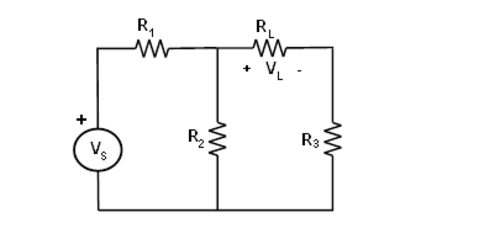

Thévenin Ersatzschaltung und maximale Leistungsübertragung
==========================================================

Zielsetzung
-----------

Das Ziel dieser Labortätigkeit ist es, das Thévenin-Theorem zu
überprüfen, indem man die Thévenin-Äquivalentspannung (V\ :sub:`TH`\)
und den Thévenin-Äquivalenzwiderstand (R\ :sub:`TH`\) für die gegebene
Schaltung erhält. Überprüfen Sie den Satz für die maximale
Leistungsübertragung.

.. note::

   .. _Hardware: https://redpitaya.readthedocs.io/en/latest/developerGuide/hardware.html
   .. _Dokumentation: http://redpitaya.readthedocs.io/en/latest/doc/developerGuide/125-14/extent.html#extension-connector-e2
   .. _E1: http://redpitaya.readthedocs.io/en/latest/doc/developerGuide/125-14/extent.html#extension-connector-e1

   In diesen Tutorials verwenden wir die Terminologie aus dem
   Benutzerhandbuch, wenn es um die Verbindungen zur Red Pitaya
   STEMlab-Board Hardware_ geht. Verlängerungsstecker-Pins, die als
   3,3 V Spannungsquelle verwendet werden, sind in der Dokumentation_
   dargestellt.
   

Hintergrund
-----------

Das Thévenin-Theorem ist ein Prozess, bei dem eine komplexe Schaltung
auf eine Ersatzschaltung reduziert wird, die aus einer einzelnen
Spannungsquelle (V\ :sub:`TH`\) in Reihe mit einem einzelnen
Widerstand (R\ :sub:`TH`\) und einem Lastwiderstand (R\ :sub:`L`\)
besteht. Nach dem Erstellen des Thévenin-Equivalenzschaltkreises kann
die Lastspannung V\ :sub:`L`\ oder der Laststrom I\ :sub:`L`\ leicht
bestimmt werden.

Eine der Hauptanwendungen des Thévenin-Theorems ist es, einen großen
Teil einer Schaltung, oft ein komplizierteres und uninteressanteres
Teil, durch ein einfaches Äquivalent zu ersetzen. Die neue einfachere
Schaltung ermöglicht eine schnelle Berechnung von Spannung, Strom und
Leistung, die die kompliziertere Originalschaltung an eine Last
liefern kann. Es hilft auch, den optimalen Wert der Last (Widerstand)
für die maximale Leistungsübertragung zu wählen.

.. _05_fig_01:
.. figure:: img/Activity_05_Fig_01.png
   :align: center

   Widerstandsnetzwerk.
	    

.. _05_fig_02:
.. figure:: img/Activity_05_Fig_02.png
   :align: center

   Thévenin-Äquivalenzschaltung von :numref:`05_fig_01`.

   
Der Maximum Power Transfer Theorem besagt, dass eine unabhängige
Spannungsquelle in Reihe mit einem Widerstand R\ :sub:`s`\ oder
eine unabhängige Stromquelle parallel zu einem Widerstand R\
:sub:`s`\ eine maximale Leistung an den Lastwiderstand R\ :sub:`L`\
liefert, wenn R\ :sub:`L`\ = R\ :sub:`s`\.
	
In Form einer Thévenin-Äquivalenzschaltung wird die maximale Leistung
an den Lastwiderstand R\ :sub:`L`\ abgegeben, wenn R\ :sub:`L`\ gleich
dem Thévenin-Äquivalenzwiderstand R\ :sub:`TH`\ der Schaltung ist.

.. _05_fig_03:

	
   Maximale Leistungsübertragung
	    
 
Materialien
-----------

Red Pitaya STEMlab 125-14 oder STEMlab 125-10 

Verschiedene Widerstände:

* 100 Ω, 
	
* 330 Ω, 
	
* 470 Ω, 
	
* 1 kΩ, 
	
* 1,5 kΩ
	

Vorgehensweise
--------------

1. Überprüfung des Thévenin-Theorems:

   a) Bauen Sie die Schaltung aus Abbildung 1 mit den folgenden Komponentenwerten:
 
      * R1 = 330 Ω
      * R2 = 100 Ω
      * R3 = 100 Ω
      * R4 = 330 Ω
      * R5 = 1 KΩ
      * Rl = 1,5 KΩ
      * Vs = +3.3V 

      .. hint:: Verwenden Sie anstelle der in Abbildung 1 dargestellten
		Spannungsquelle "V\ :sub:`s`\" den STEMlab-Spannungsstift am
		Erweiterungsstecker E1_.
	  

   b) Messen Sie die Spannung V\ :sub:`L`\ über den Lastwiderstand mit
      Hilfe der Oszilloskopanwendung. Oszilloskop-Sondendämpfung x10
      einstellen, Oszilloskopanwendung starten und im Einstellungsmenü
      IN1 und IN2 die Sondendämpfung auswählen x10
   
      Verwenden Sie die Oszilloskop-Anwendung, indem Sie den Kanal IN1
      mit dem + Knoten von V\ :sub:`L`\ verbinden und den Kanal IN2
      mit dem - Knoten verbinden. V\ :sub:`L`\ ist die Differenz
      zwischen IN1 Volt und IN2 Volt. Dieser Wert wird später mit dem
      Wert verglichen, den Sie bei Verwendung von Thevenin Equivalent
      finden.
      

   c) Ermittlung von V\ :sub:`TH`\: Entfernen Sie den Lastwiderstand
      R\ :sub:`L`\ und messen Sie die Leerlaufspannung VOC an den
      Klemmen. Verwenden Sie die Oszilloskop-Anwendung, indem Sie den
      Kanal IN1 mit dem + Knoten von V\ :sub:`OC`\ verbinden und den
      Kanal IN2 mit dem - Knoten verbinden. V\ :sub:`OC`\ wird die
      Differenz zwischen IN1 Volt und IN2 Volt sein. Das ist
      gleichbedeutend mit V\ :sub:`TH`\, vgl. :numref:`05_fig_04`.
      

      .. hint:: Um die Spannungswerte von IN1 und IN2 zu erhalten,
		wählen Sie das Menü MEAS, wählen Sie MEAN value und
		wählen Sie DONE. 

		
      .. _05_fig_04:
      .. figure:: img/Activity_05_Fig_04.png
	 :align: center
	
	 Messung der Thevenin-Spannung

		  
   d) Wenn Sie V\ :sub:`TH`\ und R\ :sub:`TH`\ erhalten, bauen Sie die
      Schaltung von Figur 2 auf. Erstellen Sie den Wert von Rrh mit
      einer seriellen und/oder parallelen Kombination von Widerständen
      aus Ihrem Bausatz.
      
      .. _05_fig_05:
      .. figure:: img/Activity_05_Fig_05.png
	 :align: center

	 Messung des Thevenin-Widerstandes R\ :sub:`TH`\. 

		  
   e) Erhalten von V\ :sub:`TH`\ und R\ :sub:`TH`\, Konstruieren der
      Schaltung von Figur 2. Schaffen Sie den Wert von R\ :sub:`rh`\
      mit einer Serien- und/oder Parallelkombination von Widerständen
      aus Ihrem Bausatz.
      

      Verwenden Sie die Anwendung Oszilloskop & Signalgenerator -
      verbinden Sie Kanal OUT1 mit der Quelle V\ :sub:`TH`\. Wählen
      Sie im Menü OUT1-Einstellungen die Signalwellenform "DC" und
      stellen Sie im Feld Amplitude den Wert auf das ein, was Sie für
      V\ :sub:`TH`\ in Schritt c) gemessen haben.
      
      Wählen Sie die Schaltfläche "Enable". 

      .. _05_fig_06:
      .. figure:: img/Activity_05_Fig_06.png
	 :align: center

	 Thevenin Equivalent Konstruktion
		   

   f) Mit R\ :sub:`L` auf die in Schritt b) verwendete 1,5 KΩ
      eingestellt, das V\ :sub:`L` für die Ersatzschaltung messen und
      mit dem in Schritt b) erhaltenen V\ :sub:`L` vergleichen. Dies
      bestätigt den Thévenin-Satz.
      

   g) Optional: Wiederholen Sie die Schritte 1 b) bis 1 f) für R\
      :sub:`L` = 2.2 KΩ
	   
	
2. Überprüfen des Theorems zur maximalen Leistungsübertragung:
	
   a) Konstruieren Sie die Schaltung wie in Abbildung 7 mit den
      folgenden Werten:
      
      * Vs = +3,3 V
      * R\ :sub:`1`\ = R\ :sub:`2`\ = 100 Ω
      * R\ :sub:`3`\ = 1 KΩ
      * R\ :sub:`L`\ = Kombinationen von 1 KΩ und 100 Ω Widerständen (Abbildung 8)

      .. _05_fig_07:
      .. figure:: img/Activity_05_Fig_07.png
	 :align: center
		 
	 Rl-Konfigurationen

   d) Berechnen Sie die Leistung für jeden Lastwiderstandswert mit 

      .. math:: P_L = \frac{V_L^{2}}{R_L}
	 :label: 05_eq_01
	    
   

		 
      Interpolieren Sie dann zwischen Ihren Messungen, um den
      Lastwiderstandswert entsprechend der maximalen Leistung
      (P\ :sub:`l max`\) zu berechnen. Dieser Wert sollte gleich
      R\ :sub:`TH` der Schaltung in Abbildung 7 in Bezug auf die
      Lastklemmen sein.

Fragen
------

1. Berechnen Sie die prozentuale Fehlerdifferenz zwischen den für die
   Schaltungen von Figur 1 und Figur 2 erhaltenen Lastspannungen.
   
2. Verwenden Sie die Spannungsteilung für den Stromkreis von Figur 2,
   berechnen Sie V\ :sub:`L`\. Vergleichen Sie es mit den
   Messwerten. Erklären Sie eventuelle Unterschiede.
   
3. Berechnen Sie die maximale Leistung, die auf die Last R\ :sub:`L`\
   übertragen wird, die für die Schaltung in Figur 3 erhalten wurde.
   

