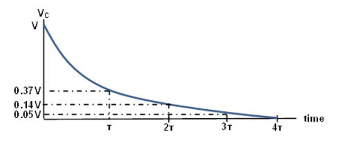

Transient Response der RC-Beschaltung
=====================================

Zielsetzung
-----------

Das Ziel dieser Labortätigkeit ist es, das transiente Verhalten einer
RC-Schaltung zu untersuchen und das Konzept der Zeitkonstante unter
Verwendung von Pulswellenformen zu verstehen.

.. note::

   .. _Hardware: http://redpitaya.readthedocs.io/en/latest/doc/developerGuide/125-10/top.html

   In diesen Tutorials verwenden wir die Terminologie aus dem
   Benutzerhandbuch, wenn es um die Verbindungen zur Red Pitaya
   STEMlab-Board Hardware_ geht. Die Oszilloskop- und
   Signalgeneratoranwendung wird zum Erzeugen und Beobachten
   von Signalen auf der Schaltung verwendet.

Hintergrund
-----------

In dieser Labortätigkeit wenden Sie eine Pulswellenform auf die
RC-Schaltung an, um das transiente Verhalten der Schaltung zu
analysieren. Die Impulsbreite in Bezug auf die Zeitkonstante einer
Schaltung bestimmt, wie sie von einer RC-Schaltung beeinflusst wird.

Zeitkonstante :math:`\tau`: Ein Maß für die Zeit, die für bestimmte
Änderungen von Spannungen und Strömen in RC- und RL-Kreisen benötigt
wird. Im Allgemeinen, wenn die verstrichene Zeit fünf Zeitkonstanten
(:math:`5 \tau`) nach dem Schalten überschreitet, haben die Ströme und
Spannungen ihren Endwert erreicht, der auch als stationäre Reaktion
bezeichnet wird (eingeschwungen).

Die Zeitkonstante einer RC-Schaltung ist das Produkt aus
Ersatzkapazität und Thévenin-Widerstand, bezogen auf die Anschlüsse
des Ersatzkondensators

.. math:: \tau = R \cdot C
   :label: 06_eq_01

Ein Impuls ist eine Spannung oder ein Strom, der von einem Niveau zum
anderen und wieder zurück wechselt. Wenn die hohe Zeit einer
Wellenform gleich ihrer niedrigen Zeit ist, wird sie als Rechteckwelle
bezeichnet. Die Länge jedes Zyklus eines Impulses ist seine Periode
:math:`T`.

Die Impulsbreite (:math:`t_p`) einer idealen Rechteckwelle entspricht der
Hälfte der Zeitspanne.

Das Verhältnis zwischen Impulsbreite und Frequenz wird dann durch, 

.. math:: f = \frac{1}{2 t_p}
   :label: 06_eq_02

	   
.. _06_fig_01:
.. figure:: img/Activity_06_Fig_01.png
   :align: center
	   
   RC-Beschaltung der Serie.
   

Aus den Kirchhoffschen Gesetzen lässt sich nachweisen, dass die
Ladespannung :math:`V_C(t)` über dem Kondensator gegeben ist als:

.. math:: V_C (t) = V \left(1 - e^{-\frac{\tau}{RC}} \right), \quad t >= 0
   :label: 06_eq_03
	   
	  

wobei :math:`V` die an die Schaltung angelegte Quellspannung für
:math:`t=0` mit Zeitkonstante :math:`RC=\tau` ist. Die Ansprechkurve
nimmt zu und ist in Abb. :numref:`06_fig_02` dargestellt.

.. _06_fig_02:
.. figure:: img/Activity_06_Fig_02.png
   :align: center

   Kondensatorladung für die RC-Beschaltung der Serie auf einen
   Schritt-Eingang mit Zeitachse normiert um :math:`tau`. 
	    
	    
Die Entladungsspannung für den Kondensator wird durch die folgende
Gleichung angegeben:

.. math:: V_C (t) = V_o e^{-\frac{\tau}{RC}}, \quad t >= 0
   :label: _06_eq_04
	   

Dabei ist V\ :sub:`0`\ die im Kondensator gespeicherte Anfangsspannung
bei t = 0 und RC = :math:`\tau` die Zeitkonstante. Die Reaktionskurve
ist eine abnehmende Exponentialfunktion, wie in Abbildung 3
dargestellt.

.. _06_fig_03:

   Kondensatorentladung für die RC-Beschaltung der Serie RC

Materialien
-----------

Red Pitaya STEMlab 125-14 oder STEMlab 125-10 

Widerstände: 
* :math:`2.2\,k\Omega` , 
* :math:`10\,k\Omega`

Kondensatoren: 
* :math:`1\,\mu F`, 
* :math:`0.01\,\mu F` 

  
Vorgehensweise
--------------

1. Bauen Sie die in Abbildung 4 dargestellte Schaltung auf Ihrer
   lötfreien Leiterplatte mit den Bauteilwerten 
   :math:`R_1 = 2.2\,k\Omega` und
   :math:`C_1 = 1\,\mu F` auf.
   
   Schließen Sie die Sonden des Oszilloskops und des
   Signalgenerators wie in :numref:`06_fig_05` dargestellt an.
     
   Stellen Sie die Oszilloskop-Dämpfung auf :math:`\times 1` ein.

          
   .. figure:: img/Activity_06_Fig_04.png
      :name: 06_fig_04
      :align: center

      Breadboard-Diagramm der RC-Schaltung :math:`R_1 = 2.2\, k\Omega` und
      :math:`C_1 = 1\, \mu F`.
   

   
   .. figure:: img/Activity_06_Fig_05.png
      :name: 06_fig_05
      :align: center

      Breadboard RC-Schaltung :math:`R_1 = 2.2\, k\Omega` und
      :math:`C_1 = 1\, \mu F`.
		 

Starten Sie die Anwendung Oszilloskop & Signalgenerator. 

2. Im Einstellungsmenü OUT1 den DC-Offsetwert auf 0,5V und den
   Amplitudenwert auf 0,5V einstellen, um eine 1-V (peak-to-peak)
   Rechteckwelle mit einer Zentrierung von 0,5 V als Eingangsspannung
   für die Schaltung anzulegen. Wählen Sie aus dem Wellenform-Menü
   SQUARE-Signal, deaktivieren Sie die SHOW-Taste und wählen Sie *enable*.
   
   Stellen Sie sicher, dass IN1 V/div und IN2 V/div beide auf
   200mV/div eingestellt sind (Sie können V/div einstellen, indem Sie
   den gewünschten Kanal auswählen und vertikale +/- Regler
   verwenden).
   
   Im Einstellungsmenü IN1 und IN2 den Wert des vertikalen Versatzes
   auf -500 mV einstellen.
   
   Für die stabile Aufnahme stellen Sie den Triggerpegel im
   TRIGGER-Menü auf 0,5V und wählen Sie NORMAL.
   

3. Beobachten Sie das Verhalten der Schaltung in den folgenden drei
   Fällen und notieren Sie die Ergebnisse.
   

   a. Impulsbreite größer als :math:`5 \tau` (z.B. :math:`15 \tau`):
      Stellen Sie die Frequenz des Ausgangs OUT1 so ein, dass der
      Kondensator bei jedem Zyklus der Rechteckwelle genügend Zeit zum
      vollständigen Laden und Entladen hat. Lassen Sie also die
      Impulsbreite 15 :math:`\tau` betragen und stellen Sie die Frequenz
      nach Gl. :eq:`06_eq_02` ein. Der von Ihnen gefundene Wert sollte
      etwa 15 Hz betragen.
   

      .. hint::

	 Berechnen Sie die Frequenz von OUT1, so dass die Impulsbreite
	 von OUT1 gleich dem Sollwert von :math:`x \cdot \tau` nach
	 :eq:`06_eq_02` ist.
		
	 .. math:: f_out = \frac{1}{2 \cdot x \cdot \tau}
	    :label: 06_eq_05

      Zum Beispiel: Wenn wir die Impulsbreite Ihres OUT1-Quadratsignals
      gleich :math:`5 \tau` haben wollen.

      (:math:`\tau` - Zeitkonstante des RC-Kreises :math:`\tau = R \cdot C` )

      .. math::
	 :label: 06_eq_06
		 
	 \tau &= R \cdot C
	 & = 2.2\,k\Omega \cdot 1\,\mu F
	 &= 2.2\,ms

	 

      .. math:: 
	 :label: 06_eq_07

	 f_out &= \frac{1}{2 \cdot 5 \cdot \tau} 
	 &= \frac{1}{2 \cdot 5 \cdot 2.2\,ms}
	 &= 45\,Hz
	

      Bestimmen Sie die Zeitkonstante aus den auf dem Bildschirm angezeigten
      Wellenformen, wenn möglich. Wenn Sie die Zeitkonstante nicht ohne
      weiteres erhalten können, erläutern Sie mögliche Gründe.

      Zur Bestimmung der Zeitkonstante verwenden Sie die Option "CURSOR".

      Öffnen Sie das Menü CURSOR und wählen Sie alle vier Cursor aus: X1,
      X2, Y1, Y1, Y2. Für den Y-Cursor wählen Sie IN2 als Quelle.
      Steuern/Bewegen von Cursorn mit einem Linksklick+Maussteuerung auf der
      Cursor-Markierung (ein Pfeil am Ende der Cursorlinie).

      Stellen Sie die **Zeitbasis** mit dem **horizontalen +/-** Regler so
      ein, dass Sie etwa zwei Zyklen der Rechteckwelle auf dem Anzeigegitter
      haben.

      .. _06_fig_06:
      .. figure:: img/Activity_06_Fig_06.png
	 :align: center

	 Oszilloskop-Schnittstelle und Signale IN1 und IN2 auf der RC-Beschaltung 

		  
      Um die Cursor genauer einzustellen, stellen Sie die Zeitbasis ein, bis
      Sie etwa eine oder die Hälfte des Zyklus der Rechteckwelle auf dem
      Anzeigegitter haben.

      .. _06_fig_07:
      .. figure:: img/Activity_06_Fig_07.png
	 :align: center

	 Messung der Zeitkonstante :math:`\tau` für OUT1 Impulsbreite
	 :math:`>> 5 \tau`. 
		  

      Setzen Sie den Cursor wie in Abbildung 2 dargestellt, indem Sie die
      Deltawerte auslesen und die Zeitkonstante berechnen.

      b. Impulsbreite = 5 :math:`\tau`: Stellen Sie die Frequenz von OUT1 so
	 ein, dass die Impulsbreite = 5 :math:`\tau` (dies sollte etwa 45 Hz
	 sein) beträgt. Da die Impulsbreite 5 :math:`\tau` beträgt, sollte
	 der Kondensator bei jedem Impulszyklus nun vollständig auf- und
	 abgeladen werden können. Mit dem Cursor-Tool bestimmen t.
   
	 .. _06_fig_08:
	 .. figure:: img/Activity_06_Fig_08.png
	    :align: center

	    Messung der Zeitkonstante :math:`\tau` für OUT1
	    Impulsbreite :math:`5 \tau`. 

      c. Impulsbreite :math:`< 5 \tau` (z.B. :math:`1 \tau`):

	 In diesem Fall hat der Kondensator keine Zeit zum Aufladen,
	 bevor er auf Entladung geschaltet wird, und umgekehrt. Die
	 Impulsbreite soll in diesem Fall nur 1 :math:`\tau` betragen
	 und die Frequenz entsprechend eingestellt werden (diese
	 sollte ca. 240 Hz betragen).
	 
	 .. _06_fig_09:
	 .. figure:: img/Activity_06_Fig_09.png
	    :align: center

	    Messung der Zeitkonstante t für OUT1 Impulsbreite :math:`1 \tau`
		     
		     
4. Wiederholen Sie den Vorgang mit :math:`R_1 = 10\,k\Omega` und
   :math:`C_1 = 0.01\,\mu F` und notieren Sie die Messungen.

	
Fragen
------
1. Berechnen Sie die Zeitkonstante nach Gl. ":eq:`06_eq_01` und vergleichen
   Sie sie mit dem Messwert aus 3a. Wiederholen Sie dies für einen
   anderen Satz von R- und C-Werten.
   
2. Diskutieren Sie die Auswirkungen von Änderungen der Komponentenwerte.

