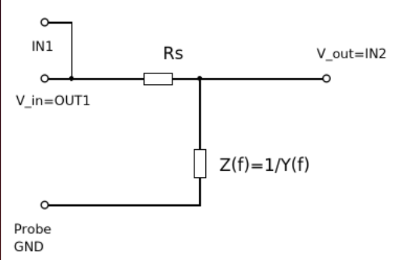
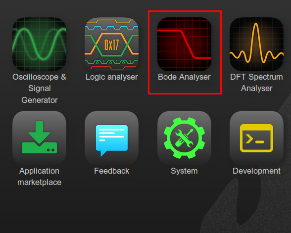

Resonanz in RLC-Schaltungen
===========================

Zielsetzung
-----------

Das Ziel dieses Versuchs ist es, das Phänomen der Resonanz in
RLC-Schaltungen zu untersuchen. Bestimmen Sie die Resonanzfrequenz und
Bandbreite des gegebenen Netzwerks anhand des Amplitudengangs zu einer
sinusförmigen Quelle.

.. note::

   .. _Hardware: https://redpitaya.readthedocs.io/en/latest/developerGuide/hardware.html
   .. _Bode: http://redpitaya.readthedocs.io/en/latest/doc/appsFeatures/apps-featured/bode/bode.html

   In diesen Tutorials verwenden wir die Terminologie aus dem
   Benutzerhandbuch. wenn es um die Anschlüsse an die Red Pitaya
   STEMlab-Karte geht. hardware_.

   Die Oszilloskop- und Signalgeneratoranwendung wird zum Erzeugen und
   Beobachten von Signalen auf der Schaltung verwendet. Die Bode_
   Analysatoranwendung wird verwendet, um den Frequenzgang der
   RLC-Schaltung zu messen.

Hintergrund
-----------

Ein Resonanzkreis, auch Abstimmkreis genannt, besteht aus einer
Induktivität und einem Kondensator sowie einer Spannungs- oder
Stromquelle. Es ist eine der wichtigsten Schaltungen in der
Elektronik. Ein Resonanzkreis in einer von vielen Formen ermöglicht es
uns beispielsweise, aus der Vielzahl der Signale, die uns jederzeit
umgeben, einen gewünschten Radio- oder Fernsehsender einzustellen.

Ein Netzwerk ist in Resonanz, wenn Spannung und Strom an den
Netzeingangsklemmen in Phase sind und die Eingangsimpedanz des
Netzwerks rein ohmscher Natur ist.

.. _08_fig_01:
.. figure:: img/Activity_08_Fig_01.png

	    Parallel-Resonanzkreis

   
Berücksichtigen Sie die parallele RLC-Schaltung von :numref:`08_fig_01`. Die von
der Schaltung angebotene stationäre Admittanz ist:

.. math:: Y = \frac{1}{R} + j \left( \omega C - \frac{1}{\omega L} \right)
   :label: 08_eq_01

Resonanz entsteht, wenn Spannung und Strom an den Eingangsklemmen
phasenrichtig sind. Dies entspricht einem rein realen Zutritt, so dass
die notwendige Bedingung gegeben ist:

.. math:: \omega C - \frac{1}{\omega L} = 0
   :label: 08_eq_02
 
Die Resonanzbedingung kann durch Einstellen von L, C oder
:math:`\omega` erreicht werden. Wenn man L und C konstant hält, wird
die Resonanzfrequenz :math:`\omega_0` durch:

.. math:: \omega_0 = \frac{1}{\sqrt{LC}} \, rad/s (1)
   :label: 08_eq_03

oder 

.. math:: f_0 = \frac {1}{2 \pi \sqrt{LC}} \, Hz (2)
   :label: 08_eq_04

.. hint:: **Frequenzgang**

	  Es handelt sich um eine Darstellung der Größe der
	  Ausgangsspannung eines Resonanzkreises als Funktion der
	  Frequenz. Die Reaktion beginnt natürlich bei Null, erreicht
	  einen Maximalwert in der Nähe der Eigenresonanzfrequenz und
	  fällt dann wieder auf Null, wenn :math:`omega` unendlich
	  wird. Der Frequenzgang ist in :numref:`08_fig_02`
	  dargestellt. 

	  .. _08_fig_02:
	  .. figure:: img/Activity_08_Fig_02.png
		    
		      Frequenzgang des Parallelschwingkreises

   
Die beiden zusätzlichen Frequenzen :math:`\omega_1` und
:math:`\omega_2` werden ebenfalls angezeigt, die als
Halbleistungsfrequenzen bezeichnet werden. Diese Frequenzen
lokalisieren diejenigen Punkte auf der Kurve, bei denen der
Spannungsverlauf :math:`1/sqrt(2)` oder das 0,707-fache des
Maximalwertes beträgt. Sie dienen zur Messung der Bandbreite der
Ansprechkurve. Dies wird als Halbwertszeit bezeichnet. Bandbreite des 
Schwingkreises und ist definiert als:

.. math:: \beta = \omega_2 - \omega_1 (3)
   :label: 08_eq_05

	   
.. _08_fig_03:   
.. figure:: img/Activity_08_Fig_03.png

	    Serien-Resonanzkreis

   
Materialien
-----------

- Red Pitaya STEMlab 125-14 oder STEMlab 125-10 
- Widerstände 100 Ω, 1 KΩ
- Kondensatoren 0,01 µF
- Induktivitäten 4,7 mH

Vorgehensweise
--------------

Zusätzliche Kalkulation: 
Mit einem der sw-Tools wie Matlab oder Python können wir die Impedanz
der parallelen RLC-Schaltung aus Figur 1 berechnen.

Die Admittanz, :math:`Y` der Parallelschaltung ist in
Gl. :eq:`08_eq_01` angegeben, wobei die Impedanz :math:`Z` als
Kehrwert der Admittanz, :math:`Z = 1 / Y` angegeben ist.

       
       
.. note:: Bei dieser Berechnung berücksichtigen wir den
	  Serienwiderstand der Spule. Dieser Widerstand beeinflusst
	  das Phasenverhalten der RLC-Schaltung bei niedrigeren
	  Frequenzen. Die obige Gleichung wird für ideale Komponenten
	  ohne parasitäre Elemente verwendet. In der Praxis
	  (Messungen) haben wir nur reale Elemente und müssen
	  berücksichtigen, dass die Spule keine reine Induktivität
	  ist, sondern auch einen effektiven Serienwiderstand hat
	  :math:`R_{esr}`, also
		

   .. math:: Y_{L} = \frac{1}{(R_{esr} + j 2 \pi f L)}.
      :label: 08_eq_06

      
.. _Impedanz: https://en.wikipedia.org/wiki/Electrical_Impedanz
.. _Antiresonatoren: https://en.wikipedia.org/wiki/Antiresonance

.. note:: Die Resonanzfrequenz ist definiert als die Frequenz, bei der
	  die Impedanz_ der Schaltung minimal ist. Äquivalent kann es
	  definiert werden als die Frequenz, bei der die Impedanz rein
	  real (d.h. rein resistiv) ist. Dies geschieht, weil die
	  Impedanzen von Induktivität und Kondensator bei Resonanz
	  gleich, aber mit entgegengesetztem Vorzeichen sind und sich
	  aufheben. Schaltungen, bei denen L und C parallel und nicht
	  in Reihe geschaltet sind, haben tatsächlich eine maximale
	  Impedanz und keine minimale Impedanz. Aus diesem Grund
	  werden sie oft als Antiresonatoren_ bezeichnet, es ist
	  jedoch üblich, die Frequenz, bei der dies geschieht, als
	  Resonanzfrequenz zu bezeichnen.
	  

Matlab-Code zur Berechnung von :math:`Z` ist unten aufgeführt.

.. literalinclude:: code/Activity_08_Code_01.m
   :language: matlab
   :linenos:
   

   
Wenn wir den obigen Code ausführen, erhalten wir folgende Ergebnisse,
die auf dem Bild unten gezeigt werden.

.. _08_fig_04:
.. figure:: img/Activity_08_Fig_04.png
 
	    Berechnung der Impedanz Z der parallelen RLC-Schaltung.
	    
 
Wir können auch den Absolutwert von Z berechnen, der die kombinierte
Impedanz der RLC-Schaltung aus :numref:`08_fig_01` ist.  Der
Absolutwert der Impedanz Z ist die Parameterform, mit der wir
vorhersagen können, wie die Messungen aussehen sollen.

Wir können die Schaltung aus :numref:`08_fig_08` modellieren, wie
in der folgenden Abbildung gezeigt, wobei :math:`Z = 1/Y` und
:math:`Y` in Gl. :eq:`08_eq_01` angegeben ist.

.. _08_fig_05:

	    Darstellung der parallelen RLC-Schaltung als komplexe
	    Impedanz Z.
	    

   
Aus :numref:`08_fig_05` können wir deutlich erkennen, dass unsere
Schaltung ein einfacher Spannungsteiler ist, wobei
:math:`V_{out} = V_{in} * Z / (R_s + Z)`. Da die Impedanz :math:`Z`
jedoch frequenzabhängig ist, ist das Verhältnis zwischen der Impedanz
:math:`Z` und dem Serienwiderstand :math:`R_s` frequenzabhängig und
damit das Spannungsübertragungsverhältnis :math:`V_{out}/V){in}`.

Bei einer Frequenz f: Wenn der Wert von Z viel kleiner als der Wert
von Rs ist, ist die Ausgangsspannungsamplitude viel kleiner als die
Eingangsspannungsamplitude.

Bei einer bestimmten Frequenz f: wenn der Wert von Z viel höher ist
als der Wert von Rs, wird die Ausgangsspannungsamplitude nahe der
Eingangsspannungsamplitude liegen.

Bei einer bestimmten Frequenz :math:`f`, wobei :math:`Z = R_s` ist
:math:`V_out = \frac{1}{2} V_in`.  

Bei einer bestimmten Frequenz :math:`f`, wobei :math:`Z` maximal ist,
ist :math:`V_out` auch maximal. Dies ist die Resonanzfrequenz.

.. _08_fig_06:
.. figure::  img/Activity_08_Fig_06.png

	     Berechnung des Absolutwertes der Impedanz Z für die in
	     :numref:`08_fig_03` dargestellte Schaltung.
	    

Durch Verwendung von

.. math:: V_{out} = V_{in} \frac{Z}{R_s + Z}
   :label: 08_eq_07

können wir den Frequenzgang unserer RLC-Schaltung berechnen. Abb. 5
und 8.

.. note:: Größenänderung in Dezibel (dB)
   
	  .. math::  H_v = 20 \cdot \log_{10}\left\lvert \frac{V_{out}}{V_{in}} \right\lvert.
	     :label: 08_eq_08

		  
.. _08_fig_07:
.. figure:: img/Activity_08_Fig_07.png

	    Berechnung des Frequenzgangs (Vout/Vin) für die Schaltung
	    in Abbildung 5. 

Vorgehensweise:

1. Bauen Sie die RLC-Schaltung wie in Abbildung 8 auf Ihrer lötfreien
   Leiterplatte mit den Bauteilwerten RS = 100 Ω, R1 = 1 KΩ, C1 = 0,1
   µF und L1= 4,7 mH auf.
   

.. _08_fig_08:
.. figure:: img/Activity_08_Fig_08.png
	    
	    Parallele RLC-Schaltung für die Messungen.

2. Öffnen Sie die Anwendung Bode analyzer. Im Menü "Einstellungen" die
   Startfrequenz auf 100Hz, die Endfrequenz auf 1MHz und die
   Schrittzahl auf 50 einstellen. Und klicken Sie auf die Schaltfläche
   "RUN".
   

.. _08_fig_09:

	    Bode Analysator Anwendung

   
Nachdem die Messungen durchgeführt wurden, sollten Sie den
Frequenzgang Ihrer Schaltung erhalten, wie in Abbildung 10
dargestellt.

.. _08_fig_10:
.. figure:: img/Activity_08_Fig_10.png

	    Frequenzgang der Schaltung aus Abbildung 8. Aufnahme durch
	    Bode Analysator-Anwendung.
   

- Vergleichen Sie Messungen und Berechnungen. Wenn es einen
  Unterschied gibt, versuchen Sie zu erklären, warum.
  

.. hint:: Parasitäre Phänomene

Die Bode-Analysatoranwendung führt einen Frequenzdurchlauf durch, so
dass sie ein Sinussignal auf OUT1 innerhalb des von uns gewählten
Frequenzbereichs (im Einstellungsmenu) erzeugt.

Das Eingangssignal IN1 ist direkt mit OUT1 verbunden, gefolgt von
IN1=Vin. IN2 wird auf der anderen Seite des RLC-Kreises und damit
IN2=Vout angeschlossen. Die Anwendung des Bode-Analysators wird dann
für jeden Frequenzschritt das Verhältnis von IN1/IN2 aufnehmen und den
Frequenzgang berechnen.

3. Um zu sehen, wie sich die Signalamplitude von Vout/IN2 in Bezug auf
   OUT1 ändert, starten Sie die Oszilloskopanwendung, aktivieren Sie
   in den OUT1 Einstellungen OUT1, deaktivieren Sie die SHOW-Taste und
   betrachten Sie die Signalamplituden von IN1 und IN2.
   
   Ändern Sie die OUT1-Frequenz, stellen Sie den t/div-Wert so ein,
   dass Sie 2 Zyklen des IN1 haben und beobachten Sie die Amplituden
   von IN1 und IN2.
   
   Wiederholen Sie diesen Schritt für die OUT1-Frequenz von 100Hz bis
   1MHz und Sie sollten den gleichen Amplitudenverlauf beobachten, wie
   er mit dem Bode-Analysator gemessen wurde.
   
   Bode-Analysator misst auch die Phase zwischen IN1 und IN2. Die
   Phase ist ebenfalls frequenzabhängig. Das kann man mit der
   Oszilloskop-Applikation leicht erkennen.
   

4. Wiederholen Sie das Experiment für den Serienschwingkreis in Figur
   3 und verwenden Sie L1 = 20 mH und C1 = 0,01 uF und R1 = 1 KΩ. Die
   Vo-Spannung am Widerstand ist proportional zum
   Serien-RLC-Schaltstrom.
   

   
Fragen
------

Zeichne den Spannungsverlauf der Schaltung auf und erhalte die
Bandbreite aus den Halbleistungsfrequenzen unter Verwendung der
Gl. :eq:`08_eq_03`.

