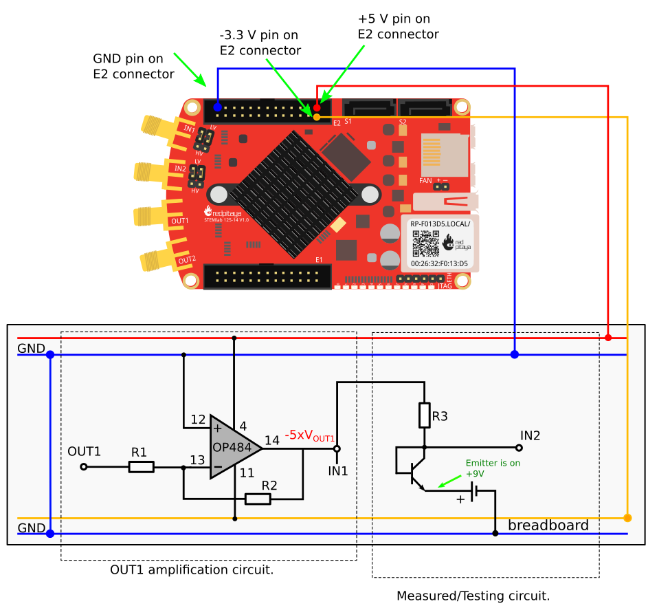

Der BJT-Transistor ist als Diode geschaltet
===========================================

Zielsetzung
-----------

Der Zweck dieser Aktivität besteht darin, die Vorwärts- und
Rückwärts-Strom-Spannungs-Kennlinie eines Bipolartransistors (BJT) zu
untersuchen, der als Diode geschaltet ist.

.. note::

   .. _hardware: http://redpitaya.readthedocs.io/en/latest/doc/developerGuide/125-10/top.html
   .. _Oscilloscope: http://redpitaya.readthedocs.io/en/latest/doc/appsFeatures/apps-featured/oscSigGen/osc.html
   .. _Signal: http://redpitaya.readthedocs.io/en/latest/doc/appsFeatures/apps-featured/oscSigGen/osc.html
   .. _generator: http://redpitaya.readthedocs.io/en/latest/doc/appsFeatures/apps-featured/oscSigGen/osc.html
   .. _here: http://redpitaya.readthedocs.io/en/latest/doc/developerGuide/125-14/extent.html#extension-connector-e2
   .. _simple: http://red-pitaya-active-learning.readthedocs.io/en/latest/Activity20_DiodeRectifiers.html
   .. _rectifier: http://red-pitaya-active-learning.readthedocs.io/en/latest/Activity20_DiodeRectifiers.html
   .. _OP484: http://www.analog.com/media/en/technical-documentation/data-sheets/OP184_284_484.pdf
   .. _inverting: http://red-pitaya-active-learning.readthedocs.io/en/latest/Activity13_BasicOPAmpConfigurations.html#inverting-amplifier
   .. _Jupyter: http://jupyter.org/index.html
   .. _Notebook: http://jupyter.org/index.html

   In diesen Tutorials verwenden wir die Terminologie aus dem
   Benutzerhandbuch, wenn Sie sich auf die Verbindungen zur Red Pitaya
   STEMlab-Board-Hardware beziehen.

   Oscilloscope_ & Signal_generator_Anwendung wird zum Erzeugen und
   Beobachten von Signalen auf der Schaltung verwendet.

   Die für die Spannungsversorgung **+5V**, **-3.3V** und **+3.3V**
   verwendeten Steckerstifte sind in der Dokumentation hier
   aufgeführt.

.. hint::
   Red Pitaya STEMlab-Ausgänge können Spannungssignale mit einem
   maximalen Ausgangsbereich von +/- 1V (2Vpp) erzeugen. Für dieses
   Experiment sind die höheren Signalamplituden erforderlich. Aus
   diesem Grund werden wir einen OP484_ in der inverting_opamp
   Konfiguration verwenden, um die Signalverstärkung von OUT1 / OUT2
   zu ermöglichen und einen Spannungshub von +4,7V bis -3,2V zu
   erreichen. Ein OP484 wird von STEMlab + 5V und -3.3V
   Spannungsschienen geliefert. Die Verstärkung des invertierenden
   Verstärkers wird auf ~ 5 gesetzt, wobei gilt :math:`R_i = 2.2\,k\Omega`
   und :math:`R_f = 10\,k\Omega`
   
   Versuchen Sie zu beantworten, warum wir ein OP484 anstelle von OP27
   oder OP97 verwendet haben. (Hinweis: *Rail-to-Rail*).
   

Materialien
-----------

- Red Pitaya STEMlab
- OP484_ Quad-Rail-Rail-Operationsverstärker
- 1kΩ Widerstand
- 10kΩ Widerstand
- 2,2 kΩ Widerstand
- kleinsignal NPN-Transistor (2N3904)
- kleinsignal PNP-Transistor (2N3906)
- lötfreies Steckbrett
- 9V Batterie

Ein NPN-Transistor, der wie in 1 gezeigt angeschlossen ist, verhält
sich wie eine reguläre Diode. Wir können dies durch Messen der
NPN-Antwort unter Verwendung der Oszilloskop- &
Signalgenerator-Anwendung zeigen.

.. figure:: img/Activity_22_Fig_01.png
   :name: 22_fig_01
   :align: center

   NPN als Diodenanschlussdiagramm
   

.. note::
   Beachten Sie, dass die in Abbildung 1 (links) gezeigte
   Verstärkerschaltung nicht das Hauptthema dieses Experiments
   ist. Diese Schaltung wird nur hinzugefügt, um das Signal OUT1 zu
   verstärken.
   
   Von hier aus können Sie Punkt :math:`-5 \times V_{OUT1}` als
   Haupterregungssignal betrachten. 

Verfahren
---------

1. Erstellen Sie die Schaltung aus Abbildung 1 auf dem
   Steckbrett. Stellen Sie R1 = 2.2kΩ, R2 = 10kΩ und R3 = 1kΩ ein
   

   .. figure:: img/Activity_22_Fig_02.png
      :name: 22_fig_02
      :align: center

      npn-Transistor als Diodenverbindung auf dem Steckbrett
   

      .. note::
	 Bevor Sie den Stromkreis an die STEMlab -3.3V und + 3.3V Anschlüsse
	 anschließen, überprüfen Sie Ihren Stromkreis. Die
	 Spannungsversorgungsstifte -3,3 V und + 3,3 V haben keinen
	 Kurzschluss und können im Falle eines Kurzschlusses beschädigt
	 werden. 

2. Starten Sie die Anwendung Oszilloskop & Signalgenerator
   
3. Stellen Sie im Menü OUT1-Einstellungen den Amplitudenwert auf 0,8
   V, den DC-Offset auf -0,12 V und die Frequenz auf 1 kHz ein, um die
   Eingangsspannung anzulegen.
   
   Wählen Sie im Wellenform-Menü TRIANGLE, deaktivieren Sie SHOW und
   wählen Sie enable.
   
4. Stellen Sie sicher, dass IN1, IN2 und MATH V / div auf der linken
   unteren Seite des Bildschirms auf 1V / div eingestellt sind (Sie
   können V / div einstellen, indem Sie die gewünschte Option
   auswählen Kanal und mit vertikalen +/- Kontrollen)
   
5. Setzen Sie t / div Wert auf 200us / div (Sie können t / div mit
   horizontalen +/- Kontrollen einstellen)
   
6. Stellen Sie unter MATH-Kanaleinstellungen folgendes ein: math:
   `IN1-IN2` und wählen Sie ENABLE.
   
7. Stellen Sie unter den Menüeinstellungen IN1 und IN2 den Messtaster
   auf x10 und den vertikalen Offset auf 0.
   

   .. figure:: img/Activity_22_Fig_03.png
      :name: 22_fig_03
      :align: center
	      
      npn-Transistor als Diodenmessungen

   
.. _previous: http://red-pitaya-active-learning.readthedocs.io/en/latest/Activity19_Diodes.html#procedure-time-domain-measurements

Aus :numref:`22_fig_03` können wir sehen, dass der NPN BJT-Transistor
in der in :numref:`22_fig_01` gezeigten Konfiguration sich wie eine
Diode verhält.

Vergleichen Sie die Ergebnisse mit den Diodenmessungen von previous_
experiment.

VI-Kurvenmessungen
------------------

Da sich BJT wie eine Diode verhalten kann (vgl. Konfiguration in
:numref:`22_fig_01`), können wir die VI-Charakteristik wie bei
Diodenmessungen messen. Für diese Aufgabe verwenden wir die Jupyter
Notebook Web-Anwendung. Wie man Jupyter Notebook startet und ein neues
Projekt erstellt, ist in :numref:`22_fig_05` dargestellt.

.. note::
   Das Jupyter_ Notebook_ ist eine Webanwendung, mit der Sie Dokumente
   erstellen und freigeben können, die Live-Code, Gleichungen,
   Visualisierungen und erklärenden Text enthalten. Sie haben auch die
   Unterstützung der Jupyter-Anwendung mit Red Pitaya-Bibliotheken
   sichergestellt, die die Steuerung aller Funktionen der
   STEMlab-Boards ermöglichen: Signalerfassung, Signalerzeugung,
   digitale Signalsteuerung, Kommunikation usw. Das Jupyter-Notebook
   wird auf die gleiche Weise gestartet wie jedes andere
   Anwendungen. Nach dem Start der Jupyter-Anwendung wird ein
   webbasiertes Notizbuch geöffnet. Diese Kombination aus Notebook,
   STEMlab und Python macht das STEMlab zu einem hervorragenden
   Werkzeug für das Prototyping und die schnelle Programmierung. Seit
   Jupyter Notebook ermöglicht Text, Gleichung und Bildbearbeitung ist
   dies ein perfektes Werkzeug für Tutorials, Beispiele und ect.
   

.. figure:: img/Activity_19_Fig_07.png
   :name: 22_fig_04
   :align: center

   Erstellen eines neuen Jupyter-Notebooks

   
Wenn Sie erfolgreich ein neues Jupyter-Notizbuch erstellt haben,
kopieren Sie den Code und fügen Sie ihn ein.

Der Code unten erzeugt das gleiche Signal wie in Abbildung 6, aber es
wird sie im XY-Diagramm darstellen.

Zum Messen :math:`VI` -Kurve wird ein "XY"-Plot benötigt, wobei
die x-Achse die Diodenspannung darstellt :math:`IN_2` und y-Achse
ein Diodenstrom :math:`(IN_1 - IN_2) / R_3`.

**Kopieren Sie den Code von unten in die Zelle 1**

	  
.. literalinclude:: code/Activity_22_Code_01.py
   :language: python
   :linenos:

Erstelle eine neue Zelle (Einfügen -> Zelle darunter) und kopiere Code
von unten hinein.

 
.. literalinclude:: code/Activity_22_Code_02.py
   :language: python
   :linenos:

Führen Sie Zelle 1 und Zelle 2 aus. notezelle 2 ist eine
Hauptschleife für die Erfassung und das erneute Plotten. Wenn Sie die
Erfassung stoppen, führen Sie nur die Zelle 2 aus  um die Messung
erneut zu starten.
 

Nach dem Ausführen des obigen Codes sollten Sie die Diode
VI-Charakteristik erhalten, wie in Abbildung 5 gezeigt.

.. figure:: img/Activity_22_Fig_05.png
   :name: 22_fig_05
   :align: center

   BJT VI-Charakteristik gemessen mit Jupyter Notebook
   

In :numref:`22_fig_05` ist die BJT VI-Charakteristik, gemessen in einer
Diodenkonfiguration, gezeigt. Vergleichen Sie diese Ergebnisse mit der
Charakteristik der Diode VI.

Wiederum können wir eine Hysterese sehen. Erklären Sie, warum wir
Transistoren als Dioden verwenden wollen?

Reverse Breakdown-Eigenschaften
-------------------------------

Hier untersuchen wir die umgekehrte Durchbruchspannungskennlinie des
Emitter-Basis-Übergangs eines Bipolartransistors (BJT), der als Diode
geschaltet ist.

Stellen Sie das Steckbrett so ein, wie es in Abbildung 6 dargestellt
ist. **Der Sender ist mit dem positiven Batteriepol verbunden.**

Die NPNs haben wahrscheinlich eine Durchbruchspannung von mehr als 10
V und es kann vorkommen, dass unser maximaler Spannungsbereich nicht
ausreichend ist, d. H. Wir werden nicht in der Lage sein, Q1 oberhalb
der Durchbruchspannung umzupolen. Aus diesem Grund haben wir eine
zusätzliche Batterie hinzugefügt, um das Emitterpotential in der Nähe
der Durchbruchsspannung zu erhöhen. Wenn also unser :math:`V_ {OUT}`
Signal NEGATIV wird, wird der Transistor REVERSED PLOARIZED aber
differentielle Spannung :math:`V_ {E-BC} = V_E - V_ {BC}` ist größer
als die BREAKDOWN-Spannung und der Transistor beginnt zu leiten.

Zum Beispiel ohne Batterie, d. H. Wenn der Emitter auf GND ist, können
wir Q1 um den Betrag polarisieren:

.. math::
   :label: 22_eq_01
	   
   V_ {E-BC} = V_E - V_ {BC} = 0 - (-3,3 V) = 3,3 V \quad \text{von} \quad \text{umgekehrte Polarisation}

Mit der Batterie können wir die umgekehrte Polarisation um den
maximalen Betrag erreichen

.. math::
   :label: 22_eq_02
	   
   V_ {E-BC} &= V_E - V_ {BC} = 9 - (-3,3 V) = 12.3 V 

Wobei :math:`V_ {BC}` der maximale negative Swing unseres
Anregungsspannungssignals ist :math:`V_ {OUT}`.

   npn-Emitter Base Reverse-Durchbruchkonfiguration

Verfahren
---------

Baue die Schaltung aus der Abbildung 6 auf dem Steckbrett und fahre
mit den Messungen fort.

.. figure:: img/Activity_22_Fig_07.png
   :name: 22_fig_07
   :align: center

   npn-Emitter Base Reverse-Durchbruchkonfiguration auf dem Steckbrett

   
Für diese Aufgabe verwenden wir die Jupyter Notebook
Web-Anwendung. Wie man Jupyter Notebook startet und ein neues Projekt
erstellt, ist in Abbildung 4 dargestellt. 

Da Sie Jupyter Notebook bereits von Previews aus ausführen, wird nur
ein kleines Update des Codes benötigt.

.. note::
   
   Sie sollten Jupyter Notebook anhalten, indem Sie das Symbol
   **Stop** in der Menüleiste auswählen.

Nach diesem Update **Zelle 2** wie unten gezeigt:
    
.. literalinclude:: code/Activity_22_Code_02.py
   :language: python
   :linenos:

Wie Sie aus dem obigen Code sehen können **haben wir nur "-9"**
hinzugefügt, um das Potential der Batterie bei der Ausführung des
Plottings zu berücksichtigen.
   
Wählen Sie Zelle 2 und drücken Sie ** Play ** in der
Menüleiste. Beachten Sie, Zelle 2 ist eine Hauptschleife für die
Erfassung und das erneute Plotten. Wenn Sie die Erfassung stoppen,
führen Sie nur die Zelle 2 aus, um die Messungen erneut zu starten.
   

Achten Sie darauf, die tatsächliche Batteriespannung für die
genauesten Messungen zu messen.

Wenn Sie den Jupyter Notebook-Code aktualisiert und korrekt ausgeführt
haben, sollten Sie ähnliche Ergebnisse wie in Abbildung 8 erhalten.

.. figure:: img/Activity_22_Fig_08.png
   :name: 22_fig_08
   :align: center

   Messung der NPN-Emitter-Basis-Durchbruchspannung
   

Aus :numref:`22_fig_08` können wir sehen, dass die umgekehrte
Durchbruchspannung des NPN BJT 2N3904-Transistors etwa 10 V beträgt.

Frage
------

Trennen Sie den Kollektor von Q1 und lassen Sie ihn offen. Wie
ändert sich die Durchbruchspannung?
   

Absenken der effektiven Durchlassspannung der Diode
---------------------------------------------------

Hier untersuchen wir eine Schaltungskonfiguration mit kleineren
Vorwärtsspannungseigenschaften als die eines bipolaren

Sperrschichttransistor (BJT) als Diode geschaltet. Die
Einschaltspannung der "Diode" sollte etwa 0,1 V betragen im Vergleich
zu 0,7 V für die einfache Diodenverbindung im ersten Beispiel.

.. figure:: img/Activity_22_Fig_09.png
   :name: 22_fig_09
   :align: center

   Konfiguration zur Reduzierung des effektiven Durchlassspannungsabfalls der Diode

Verfahren
---------

1. Erstellen Sie die Schaltung aus Abbildung 9 auf dem
   Steckbrett. Setze R3 = 1kΩ, R4 = 100kΩ und verwende für Q1 2N3904
   NPN und für Q2 2N3904 PNP-Transistor.
   

.. figure:: img/Activity_22_Fig_10.png
   :name: 22_fig_10
   :align: center

   Konfiguration zur Verringerung des effektiven
   Durchlassspannungsabfalls der Diode auf dem Steckbrett
   

.. warning::
   Bevor Sie den Stromkreis an die STEMlab -3.3V und + 3.3V Anschlüsse
   anschließen, überprüfen Sie Ihren Stromkreis. Die
   Spannungsversorgungsstifte -3,3 V und + 3,3 V haben keinen
   Kurzschluss und können im Falle eines Kurzschlusses beschädigt
   werden.
   

2. Starten Sie die Anwendung Oszilloskop & Signalgenerator
   
3. Stellen Sie im Menü OUT1-Einstellungen den Amplitudenwert auf 0,8
   V, den DC-Offset auf -0,12 V und die Frequenz auf 1 kHz ein, um die
   Eingangsspannung anzulegen.
   
   Wählen Sie im Wellenform-Menü TRIANGLE, deaktivieren Sie SHOW und
   wählen Sie enable.
   
4. Vergewissern Sie sich auf der linken unteren Seite des Bildschirms,
   dass IN1 V / div auf 1 V / div und IN2 V / div auf 500 mV / div
   eingestellt ist (Sie können V / div einstellen, indem Sie die
   gewünschte Option auswählen Kanal und mit vertikalen +/-
   Kontrollen)
   
5. Setzen Sie t / div Wert auf 200us / div (Sie können t / div mit
   horizontalen +/- Kontrollen einstellen)
   
6. Stellen Sie unter den Menüeinstellungen IN1 und IN2 den Messtaster
   auf x10 und den vertikalen Offset auf 0.
   
7. Stellen Sie unter MATH-Menüeinstellungen den vertikalen Offset auf
   0 ein.
   

   .. figure:: img/Activity_22_Fig_11.png
      :name: 22_fig_11
      :align: center

      Geringerer effektiver Vorwärtsspannungsabfall von Diodenmessungen

   
      .. warning::

	 Wie sie :numref:`22_fig_11` entnehmen können, beträgt der
	 Vorwärtsspannungsabfall etwa 100 mV. Sie können auch feststellen,
	 dass Q2 nicht notwendig ist, um die Drop-Down-Spannung des Q1 zu
	 senken.
   
	 Die Hauptrolle spielt hier der Widerstand R4, der mit der Basis von
	 Q1 verbunden ist. Versuchen Sie, Q2 zu entfernen und die Ergebnisse
	 zu beobachten.
   

Fragen
------

Könnte der Kollektor des PNP Q2 mit einem anderen Knoten wie einer
negativen Versorgungsspannung verbunden sein? Und was wäre der
Effekt?
