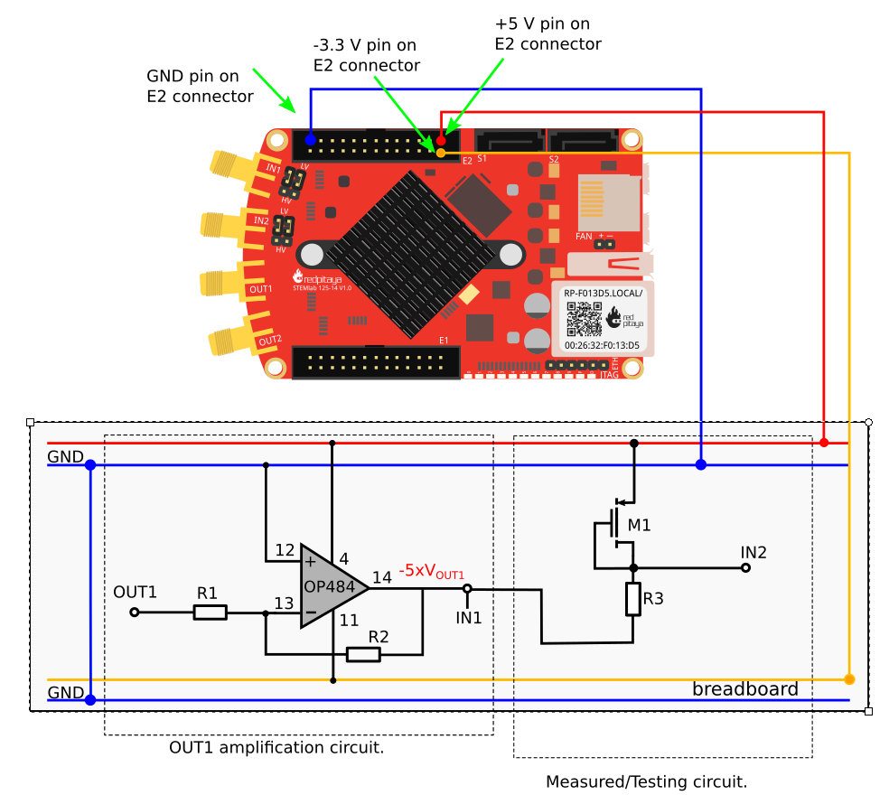

Die Nutzung der MOS-Transistors als Diode
=========================================

Zielsetzung
-----------

Ziel dieses Versuchs ist die Untersuchung, der
Vorwärtsstrom-Spannungs-Charakteristik eines MOS-Feldeffekttransistors
(NMOS und PMOS), der als eine Diode geschaltet ist. Vor diesem Experiment wird
eine Übersicht über den vorherigen Versuch_ empfohlen.

Anmerkung
--------
   
.. _Hardware: http://redpitaya.readthedocs.io/en/latest/doc/developerGuide/125-10/top.html
.. _Signalgeneratoranwendung: http://redpitaya.readthedocs.io/en/latest/doc/appsFeatures/apps-featured/oscSigGen/osc.html
.. _Dokumentation: http://redpitaya.readthedocs.io/en/latest/doc/developerGuide/125-14/extt.html#extension-connector-e2
.. _simple: http://red-pitaya-active-learning.readthedocs.io/en/latest/Activity20_DiodeRectifiers.html
.. _rectifier: http://red-pitaya-active-learning.readthedocs.io/en/latest/Activity20_DiodeRectifiers.html
.. _OP484: http://www.analog.com/media/en/technical-documentation/data-sheets/OP184_284_484.pdf
.. _invertierenden: http://red-pitaya-active-learning.readthedocs.io/en/latest/Activity13_BasicOPAmpConfigurations.html#inverting-amplifier
.. _Notebook: http://jupyter.org/index.html
.. _ZVN211: http://www.redrok.com/MOSFET_ZVN2110A_100V_320mA_4O_Vth2.4_TO-92_ELine.pdf
.. _ZVP211: https://www.diodes.com/assets/Datenblätter/ZVP2110A.pdf
.. _Versuch: http://red-pitaya-active-learning.readthedocs.io/en/latest/Activity22_TheBJTasDiode.html

In diesen Tutorials verwenden wir die Terminologie aus dem
Benutzerhandbuch, wenn Sie sich auf die Verbindungen zur Red Pitaya
STEMlab - Board - Hardware_ beziehen.

Die Oszilloskop- und Signalgeneratoranwendung_ wird zum Erzeugen und
Beobachten von Signalen auf der Schaltung verwendet.

Die für die Spannungsversorgung **+5V**, **-3.3V** und **+3.3V**
verwendeten Steckerstifte sind in der Dokumentation_ aufgeführt.

.. note::
   Red Pitaya STEMlab-Ausgänge können Spannungssignale mit einem
   maximalen Ausgangsbereich von :math:`+/-\,1\,V` (2Vpp) erzeugen. Für diesen Versuch
   werden höhere Signalamplituden benötigt. Aus
   diesem Grund werden wir einen OP484_ in der invertierenden
   Konfiguration verwenden, um die Signalverstärkung von OUT1 / OUT2
   zu ermöglichen und einen Spannungshub von +4,7V bis -3,2V zu
   erreichen. Ein OP484 wird von STEMlab + 5V und -3.3V
   Spannungsschienen versorgt. Der Verstärkungfaktor des invertierenden
   Verstärkers wird auf :math:`\approx 5` gesetzt, wobei
   :math:`R1 = 2.2\,k\Omega` und :math:`R2 = 10 \,k\Omega` eingesetzt werden. 

   Versuchen Sie zu beantworten, warum wir ein OP484 anstelle von OP27
   oder OP97 verwendet haben. (Hinweis:"Schiene-zu-Schiene").
   

Materialien
-----------

- Red Pitaya STEMlab
- OP484_ Quad-Rail-Rail-Operationsverstärker
- :math:`1\,k\Omega` Widerstand
- Kleinsignal-NMOS-Transistor (ZVN211_)
- Kleinsignal-PMOS-Transistor (ZVP211_)
- lötfreies Steckbrett

  
NMOS als Diode
--------------

Die Schaltung des NMOS in Diodenkonfiguration ist in :numref:`23_fig_02`
gezeigt. In der Diodenkonfiguration arbeitet der NMOS anders als der
NPN BJT-Transistor. 

Die Schwellenspannung(Threshold Voltage) liegt nicht zwingend bei :math:`\approx 0,7\,V`, sie
hängt von der Größe des Transistors und seinen Eigenschaften ab. Für den
ausgewählten NMOS-Transistor liegt die Schwellenspannung
:math:`V_{TH}` bei etwa :math:`2,4\,V`. Das bedeutet, sollte die am Gate-Pin
anliegende Spannung den :math:`V_ {TH}` von :math:`2,4\,V`überschreitet "schaltet"
der MOS_Transistor ein und beginnt zu leiten. Da der Drain (D) -Pin schalttechnisch mit dem Gate-Pin
des Transistors verbunden ist, bleibt das Potential von :math:`D-G`
auf dem Pegel der Schwellenspannung :math:`V_{TH}`.

.. note::
   Diese Konfiguration von NMOS erzeugt effektiv eine Diode mit Durchlassspannung,
   die der :math:`V_ {TH}` entspricht. 

.. figure:: img/Activity_23_Fig_01.png
   :name: 23_fig_01

   ZVN211_ Spezifikationen

   
Auf dem Steckbrett die Schaltung aus :numref:`23_fig_02` aufbauen und mit den
Messungen fortfahren.

.. figure:: img/Activity_23_Fig_02.png
   :name: 23_fig_02
   :align: center

   Anschlussdiagramm der NMOS-Diode

Verfahren
----------

1. Bauen Sie die Schaltung aus :numref:`23_fig_01` auf dem
   Steckbrettauf. Stellen Sie :math:`R1 = 2,2\,k\Omega`, :math:`R2 = 10\,k\Omega` und :math:`R3 = 1\,k\Omega` ein. Für
   M1 nehmen Sie ZVN211.
   

   .. figure:: img/Activity_23_Fig_03.png
      :name: 23_fig_03
      :align: center

      NMOS-Diodenverbindung auf dem Steckbrett

   
   .. warning::
      Bevor Sie die Schaltung an die STEMlab-Pins -3,3V und +3,3V anschließen,
      überprüfen Sie Ihre Schaltung nochmal. Die Spannungsversorgungsstifte
      -3,3V und +3,3V haben keine Schutzschaltung und können im Falle eines
      Kurzschlusses beschädigt werden.

   
2. Starten Sie die Anwendung Oszilloskop & Signalgenerator
   
3. Stellen Sie im Menü OUT1-Einstellungen den Amplitudenwert auf :math:`0,45\,V`,
   den DC-Offset auf :math:`-0,45\,V` und die Frequenz auf :math:`1 kHz` ein, um die
   Eingangsspannung anzulegen. Wählen Sie im Wellenform-Menü TRIANGLE, deaktivieren
   Sie SHOW und wählen Sie Enable.
   
4. Stellen Sie sicher, dass IN1, IN2 und MATH :math:`V/div` auf der linken
   unteren Seite des Bildschirms auf :math:`1\,V/div` eingestellt sind (Sie
   können :math:`V/div` einstellen, indem Sie die gewünschten Kanal auswählen
   und mit vertikalen +/- Regler verwenden)
   
5. Setzen Sie :math:`t/div` Wert auf :math:`200\,us/div` (Sie können :math:`t/div` mit
   horizontalen +/- Reglern einstellen)
   
6. Stellen Sie unter MATH-Kanaleinstellungen :math:`IN1-IN2` ein
   und wählen Sie ENABLE.
	 
7. Stellen Sie unter den Menueinstellungen IN1 und IN2 den Messtaster
   auf x10 und den vertikalen Offset auf 0.
   
8. Stellen Sie unter Einstellungen des MATH-Menus den vertikalen
   Offset auf 0 ein.
   
9. Stellen Sie unter TRIGER-Einstellungen den Triggerpegel auf :math:`1\,V` ein

   .. figure:: img/Activity_23_Fig_04.png
      :name: 23_fig_04
      :align: center

      NMOS-Diodenanschluss-Messungen

   
VI-Kurvenmessungen
------------------

Da sich NMOS wie eine Diode mit einer Durchlassspannung entsprechend der :math:`V_{TH}`
verhalten kann (Konfiguration in :numref:`23_fig_02`), können wir ihre VI-Charakteristik
wie bei Diodenmessungen messen, wofür wir die Webanwendung Jupyter Notebook verwenden werden.
Wie Sie Jupyter Notebook starten und ein neues Projekt erstellen, ist
in :numref:`23_fig_05` als Flussdiagramms dargestellt.

.. note::
   Das Jupyter Notebook_ ist eine Webanwendung, mit der Sie Dokumente erstellen
   und freigeben können, die Live-Code, Gleichungen, Visualisierungen und
   erklärenden Text enthalten. Sie haben auch die Unterstützung für die
   Jupyter-Anwendung mit Red Pitaya-Bibliotheken sichergestellt, die die Steuerung
   aller Funktionen der STEMlab-Boards ermöglichen, wie z.B.: Signalerfassung,
   Signalerzeugung, digitale Signalsteuerung, Kommunikation usw. Das Jupyter Notebook
   wird auf die gleiche Weise gestartet wie alle anderen Anwendungen. Nach dem Start
   der Jupyter-Anwendung wird ein webbasiertes Notebook geöffnet. Diese Kombination
   aus Notebook, STEMlab und Python macht das STEMlab zu einem hervorragenden Werkzeug
   für Prototyping und schnelle Programmierung. Da Jupyter Notebook Text-, Gleichungs-
   und Bildbearbeitung ermöglicht, ist es ein perfektes Werkzeug für Tutorials, Beispiele
   und vieles mehr.

   
.. figure:: img/Activity_19_Fig_07.png
   :name: 23_fig_05
   :align: center

   Erstellen eines neuen Jupyter-Notebooks

Wenn Sie erfolgreich ein neues Jupyter-Notizbuch erstellt haben,
kopieren Sie den Code und fügen Sie ihn ein.

Der Code unten erzeugt das gleiche Signal wie in :numref:`23_fig_04`, aber es
wird sie im XY-Diagramm darstellen.

Zum Messen VI-Kurve wird ein "XY"-Plot benötigt, wobei die
x-Achse die Diodenspannung darstellt
:math:`IN_2` und y-Achse ein Diodenstrom :math:`(IN_1 - IN_2) / R_3`.

**Kopieren Sie den Code von unten in die Zelle 1**

.. literalinclude:: code/Activity_23_Code_01.py
   :language: python
   :linenos:
      
    
Erstelle eine neue Zelle (Einfügen -> Zelle darunter) und kopiere
Code von unten hinein.
 

.. literalinclude:: code/Activity_23_Code_02.py
   :language: python
   :linenos:

	  
Führen Sie Zelle 1 und Zelle 2 aus. notezelle 2 ist eine
Hauptschleife für die Erfassung und das erneute Plotten. Wenn Sie die
Erfassung stoppen, führen Sie nur die Zelle 2 aus um die Messung erneut zu starten.

Nach dem Ausführen des obigen Codes sollten Sie die Diode
VI-Charakteristik erhalten, wie in :numref:`23_fig_05` gezeigt.

   NMOS VI-Kennlinie gemessen mit Jupyter Notebook

   
   
PMOS als Diode
--------------

Gleiche Maße können auch für PMOS-Transistor gelten. Beim
PMOS-Transistor ist die Polarität der Spannung umgekehrt, so dass die
Konfiguration der PMOS-Diode anders sein muss NMOS eins. Die
Konfiguration der PMOS-Diode ist in :numref:`23_fig_07` dargestellt.

.. figure:: img/Activity_23_Fig_07.png
   :name: 23_fig_07
   :align: center

   Anschlussdiagramm der PMOS-Diode

   

Verfahren
---------

1. Erstellen Sie die Schaltung aus :numref:`23_fig_07` auf dem
   Steckbrett. Stellen Sie R1 = 2.2kΩ, R2 = 10kΩ und R3 = 1kΩ ein. Für
   M1 nimm ZVP211.

   .. warning::
      Bevor Sie den Stromkreis an die STEMlab :math:`-3.3\,\text{V}` und
      :math:`+3.3\,\text{V}` Anschlüsse anschließen, überprüfen Sie Ihren
      Stromkreis. Die Spannungsversorgungsstifte -3,3 V und +3,3 V haben
      keinen Kurzschluss und können im Falle eines Kurzschlusses
      beschädigt werden.
   

2. Starten Sie die Anwendung Oszilloskop & Signalgenerator
   
3. Stellen Sie im Menü OUT1-Einstellungen den Amplitudenwert auf 0,45
   V, den DC-Offset auf -0,45 V und die Frequenz auf 1 kHz ein, um die
   Eingangsspannung anzulegen.
   
   Wählen Sie im Wellenform-Menü TRIANGLE, deaktivieren Sie SHOW und
   wählen Sie enable.
   
4. Stellen Sie sicher, dass IN1, IN2 und MATH V / div auf der linken
   unteren Seite des Bildschirms auf 1V / div eingestellt sind (Sie
   können V / div einstellen, indem Sie die gewünschte Option
   auswählen Kanal und mit vertikalen +/- Kontrollen)
   
5. Setzen Sie t / div Wert auf 200us / div (Sie können t / div mit
   horizontalen +/- Kontrollen einstellen)
   
6. Stellen Sie unter MATH-Kanaleinstellungen folgendes ein
   :math:`IN1-IN2` und wählen Sie ENABLE.
	 
7. Stellen Sie unter den Menüeinstellungen IN1 und IN2 den Messtaster
   auf x10 und den vertikalen Offset auf 0.
   
8. Stellen Sie unter Einstellungen des Menüs MATH den vertikalen
   Offset auf 0 ein.
   
9. Stellen Sie unter TRIGER-Einstellungen den Triggerpegel auf 1V ein

.. figure:: img/Activity_23_Fig_08.png
   :name: 23_fig_08
   :align: center

   PMOS-Diodenanschlussmessungen

   
Wie in :numref:`23_fig_08` zu sehen, verhält sich der PMOS in der
Diodenkonfiguration wie eine Diode mit einer Vorwärtsabfallspannung
gleich dem PMOS :math:`V_ {TH}`. Vergleichen Sie die Abbildungen 8 und
4 und versuchen Sie, den Unterschied zwischen NMOS- und
PMOS-Diodenkonfigurationen zu erklären.

