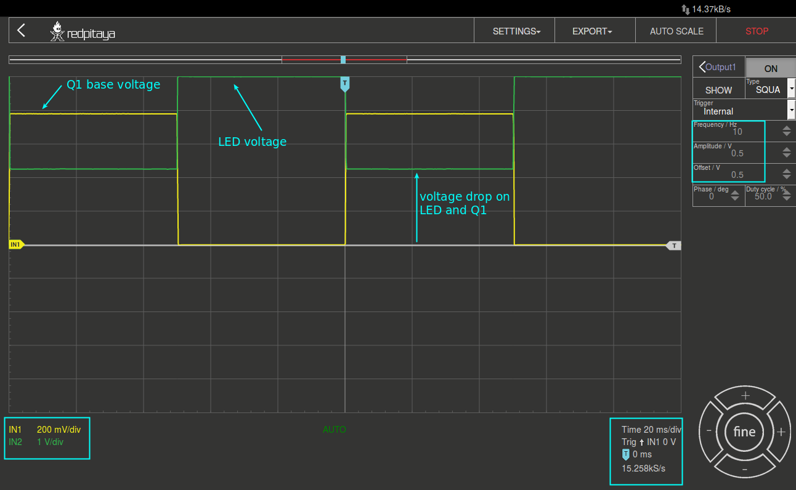

BJT-Transistor als Schalter
===========================

Zielsetzung
-----------

Ein Bipolartransistor ("BJT") kann in vielen Schaltungskonfigurationen wie
Verstärker, Oszillator, Filter, Gleichrichter oder einfach nur als Ein-/Ausschalter
verwendet werden. Wenn der Transistor in den linearen Bereich vorgespannt ist,
arbeitet er als Verstärker oder eine andere lineare Schaltung, wenn er abwechselnd
in den Sättigungs- und Trennbereichen vorgespannt ist, dann wird er als Schalter
verwendet, der den Strom in anderen Teilen der Schaltung fließen lässt oder nicht.
Dieser Versuch beschreibt den BJT bei Betrieb als Schalter.

Anmerkungen
-----------

.. _Hardware: http://redpitaya.readthedocs.io/en/latest/doc/developerGuide/125-10/top.html
.. _Signalgeneratoranwendung: http://redpitaya.readthedocs.io/en/latest/doc/appsFeatures/apps-featured/oscSigGen/osc.html
.. _Dokumentation: http://redpitaya.readthedocs.io/en/latest/doc/developerGuide/125-14/extt.html#extension-connector-e2
.. _Datenblatt: https://www.sparkfun.com/datasheets/Components/2N3904.pdf

In diesen Tutorials verwenden wir die Terminologie aus dem Benutzerhandbuch,
wenn es um die Verbindungen zur Red Pitaya STEMlab Board Hardware_ geht.
Die Oszilloskop- und Signalgeneratoranwendung_ wird zum Erzeugen und Beobachten
von Signalen auf der Schaltung verwendet. Die für die +5V-Spannungsversorgung v
erwendeten Verlängerungsstecker-Pins sind in der Dokumentation dargestellt.

Hintergrund
-----------

Schaltkreise unterscheiden sich deutlich von linearen Schaltkreisen. Sie sind auch
leichter zu verstehen. Bevor wir komplexere Schaltungen untersuchen, beginnen wir
mit der Einführung diskreter Halbleiter-Schaltkreise: solche, die auf BJTs basieren.

Ein Schalter besteht aus einem BJT-Transistor, der abwechselnd zwischen dem Sättigungs- und
dem Cutoff-Bereich angesteuert wird. Eine einfache Version des Schalters ist in :numref:`24_fig_01`
dargestellt. Wenn der Eingang gleich :math:`-V_{in}` ist, ist die Basis-Emitter-Verbindung umgekehrt
vorgespannt oder ausgeschaltet, so dass kein Strom im Kollektor fließt. Dies wird durch die in
der Abbildung dargestellte rote Belastungslinie veranschaulicht. Wenn sich der BJT in der
Cutoff-Phase befindet, hat die Schaltung (idealerweise) die folgenden Werte:

.. math::
   :label: 24_eq_1
  
    V_{CE} = V_{CC} \quad \text{und} \quad I_C = 0 A

    
Dieser Zustand ist vergleichbar mit einem offenen Schalter. Wenn der
Eingang gleich :math:`+V_{in}` ist, wird der Transistor in die Sättigung
gefahren und es treten die folgenden Bedingungen auf:

.. math::
   :label: 24_eq_2
  
    V_{CE} \approx 0 \quad \text{und} \quad I_{C_{sat}} = \frac{V_{CC}}{R_C} A \quad

Dieser Zustand ist vergleichbar mit einem geschlossenen Schalter,
der den unteren Teil des :math:`R_C` mit der Masse verbindet.
      
.. figure:: img/ Activity_24_Fig_01.png
   :name: 24_fig_01
   :align: center

   NPN BJT-Schalter und seine Lastlinie

Die Eigenschaften eines BJT-Schalter gehen davon aus:

1. :math:`-V_ {in}` ist niedrig genug, um den Transistor in
   Abschaltung zu treiben.
   
2. :math:`+ V_ {in}` muss genug Basisstrom durch :math:`R_B` erzeugen, um den
   Transistor in Sättigung zu treiben.
   
3. Der Transistor ist eine ideale Komponente.

   
Diese Bedingungen können durch folgende Auslegung der Schaltung gewährleistet werden:

1. :math:`-V_{in} = V_{BE}`
   
2. :math:`+V_{in} = V_{BE} + I_B R_B` (:math:`V_{CC}` ist ein
   gutes Maximum)
   
3. :math:`I_B > I_{C_{sat}} / \beta`

Bedingung 1 gewährleistet, dass die Schaltung durch den Eingang in den
Cutoff-Bereich gefahren wird. Die Bedingungen 2 und 3 stellen sicher,
dass der Transistor in den Sättigungsbereich gefahren wird. Ein
tatsächlicher BJT-Schalter unterscheidet sich in mehrfacher Hinsicht
vom idealen Schalter. In der Praxis kommt es auch in der Abschaltung
zu einem kleinen Ableitstrom durch den Transistor. Außerdem fällt in
der Sättigung immer etwas Spannung über den Innenwiderstand des Transistors
ab. Typischerweise liegt diese zwischen :math:`0,2` und :math:`0,4\,V` in der Sättigung,
abhängig vom Kollektorstrom und der Größe des Bauelements. Diese Abweichungen
vom Ideal sind bei einem richtig dimensionierten Gerät im Allgemeinen gering,
so dass wir bei der Analyse oder Konstruktion eines BJT-Schaltkreises von
nahezu idealen Bedingungen ausgehen können.

.. figure:: img/Activity_24_Fig_02.png
   :name: 24_fig_02
   :align: center

   NPN-LED-Schalter

Materialien
-----------

- Red Pitaya STEMlab
- 1x :math:`1\,k\Omega` Widerstand
- 1x :math:`100\,\Omega` Widerstand
- 1x 5mm LED (jede Farbe)
- 1x kleinsignal NPN-Transistor (2N3904)
- 1x lötfreies Steckbrett

  
Verfahren
---------

1. Bauen Sie die Schaltung aus Abbildung 2 auf dem Steckbrett auf. SetzenSie für
   :math:`R_B` = 1k:math:`Omega`, :math:`R_C` = 100:math:`Omega`
	 

.. figure:: img/Activity_24_Fig_03.png
   :name: 24_fig_03
   :align: center

   NPN LED-Schalter auf dem Steckbrett

2. Starten Sie die Anwendung Oszilloskop & Signalgenerator
   
3. Stellen Sie im Menü OUT1-Einstellungen den Amplitudenwert auf :math:`0,5\,V`,
   den DC-Offset auf :math:`0,5\,V` und die Frequenz auf :math:`10\,Hz` ein, um die
   Eingangsspannung anzulegen. Wählen Sie im Wellenform-Menü SQUARE,
   deaktivieren Sie SHOW und wählen Sie Enable.
   
4. Stellen Sie sicher, dass IN1 :math:`V/div` am linken unteren
   Bildschirmrand auf :math:`200\,mV/div` und IN2 auf :math:`1\,V/div` eingestellt ist
   (Sie können :math:`V/div` einstellen, indem Sie die gewünschten Kanal auswählen und
   vertikale +/- Regler verwenden)
   
5. Setze :math:`t/div` Wert auf :math:`20\,ms/div` (Du kannst :math:`t/div` mit
   horizontalen +/- Reglern einstellen)
   
6. Stellen Sie unter IN2-Menüeinstellungen Sonde auf x10 und
   vertikalen Offset auf 0 ein.
   
7. Setzen Sie unter IN1 den vertikalen Offset auf 0.

   

   NPN als Schalter Messungen

Aus :numref:`24_fig_04` können wir das Verhalten des NPN-Transistors beobachten,
wenn er als Schalter arbeitet. Wenn die Basisspannung "hoch" ist, wird der
Transistor "eingeschaltet", so dass der Strom von der +5V-Spannungsschiene
durch die Diode zum GND fließt. Wenn der Strom fließt, blinkt die LED. In
diesem "eingeschalteten" Zustand sehen wir IN2 (LED-Spannung geht nicht auf :math:`0\,V`).
Dies ist der Einfluss der Schwellspannungen der LED-Diode und des Q1-Transistors.
Aus :numref:`24_fig_04` können wir diesen Spannungsabfall messen, der bei :math:`\approx 2,2\,V` liegt.
Versuchen Sie zu messen, wie viel Abfallspannung durch Q1 verursacht wird und
wie viel durch die LED. Wenn die Basisspannung "low" ist, wird der Transistor
"ausgeschaltet" und der Stromfluss deaktiviert, daher ist die LED-Spannung gleich :math:`R1`, d.h. :math:`5\,V`.

Fragen
------

1. Wieviel Strom fließt in den Widerständen :math:`R_C` und :math:`R_B`
   wenn die LED an ist und wenn die LED aus ist?
   
2. Berechnen Sie :math:`\beta`, wenn Q1 gesättigt ist. Wie
   vergleicht sich dieser Wert mit der im Datenblatt_ angegebenen
   Spezifikation?
   

