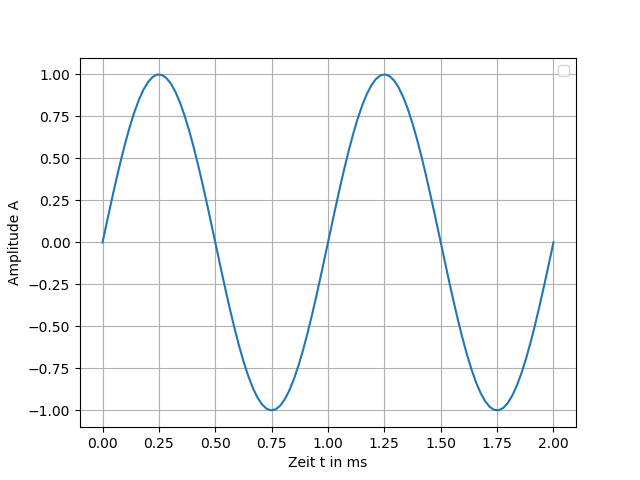
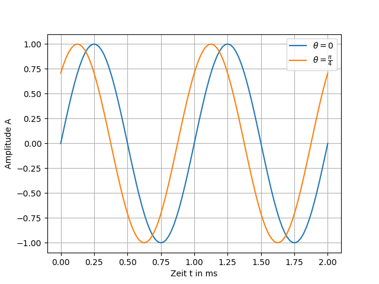
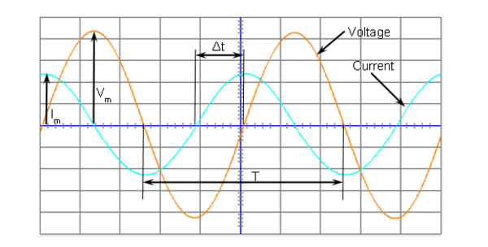
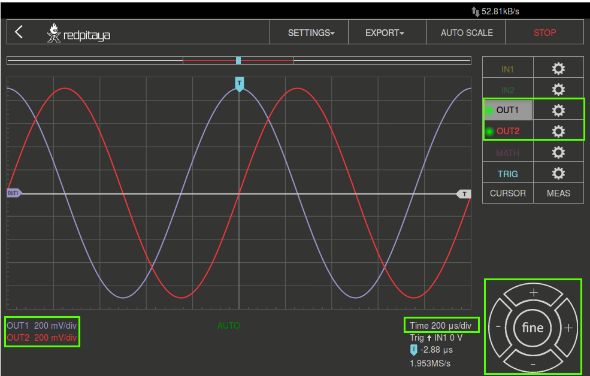
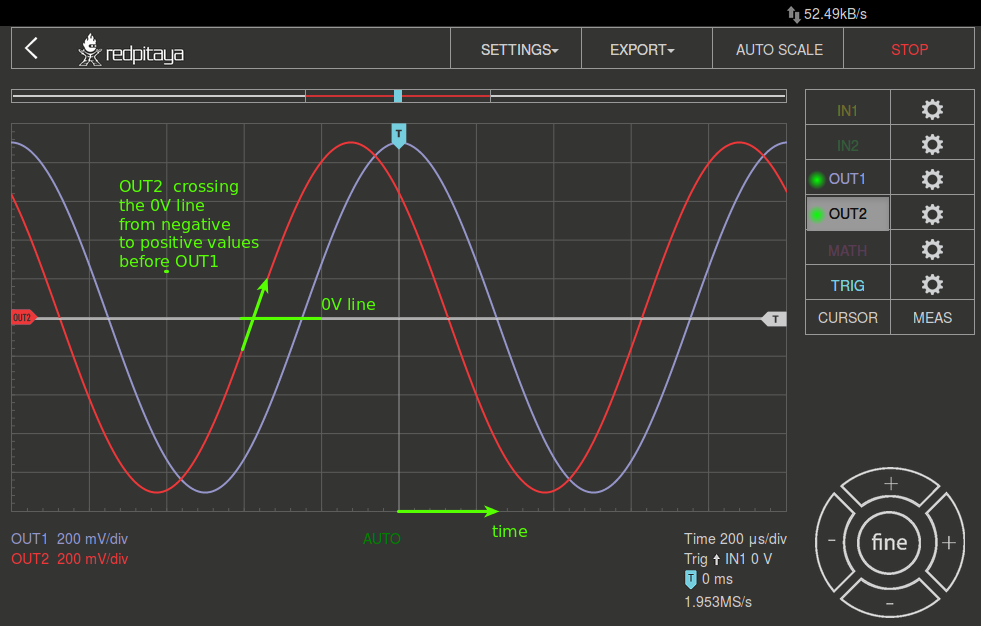
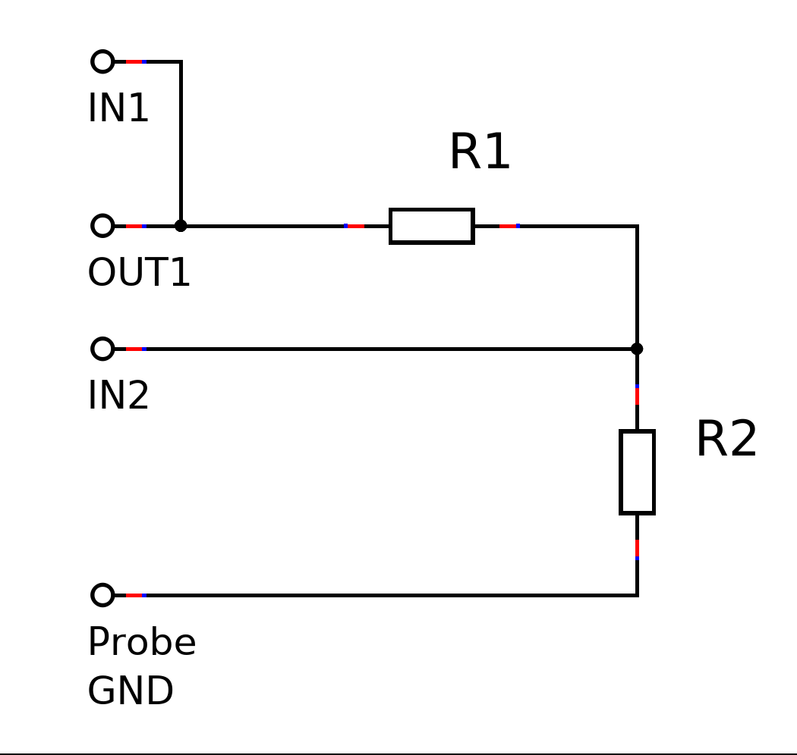
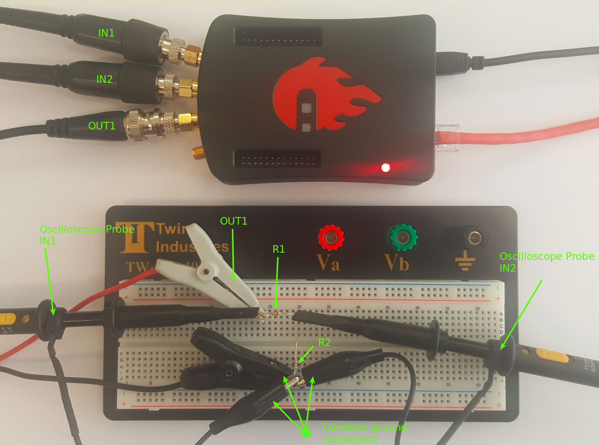
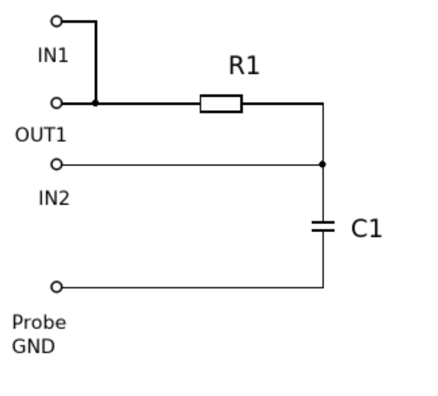
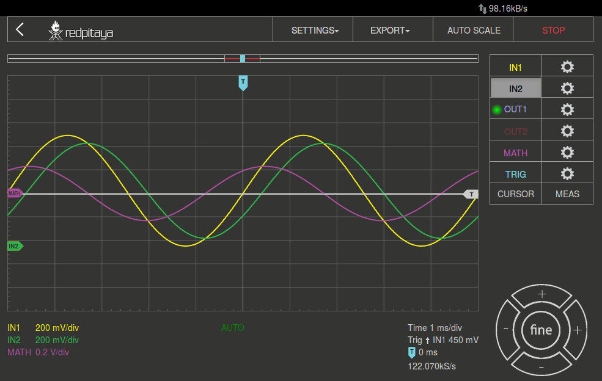

Was ist Phase?
==============

Zielsetzung
-----------

In diesem Versuch soll der Begriff der "Phase" zwischen zwei Signalen untersucht werden.
Ziel ist es, die Phasenbeziehung dieser Signale zu einander zu verstehen und durch praktische
Untersuchung, die Theorie in die Praxis umzusetzen.
Des Weiteren soll ein erstes Verständnis für die Bedienung von Redpitaya STEMIlab Hardware
und der dazugehörigen Software gewonnen werden. 

Anmerkungen
-----------

.. _Hardware: https://redpitaya.readthedocs.io/en/latest/developerGuide/hardware.html

Die, in diesem Versuch, verwendete Terminologie, bezieht sich auf das Handbuch der RedPitaya STEMIlab Hardware_.

Hintergrund
-----------

Wir werden das Konzept der Phase untersuchen, indem wir Sinuswellen
und passive Komponenten betrachten, die es uns ermöglichen, die
Phasenverschiebung mit reelen Signalen zu beobachten. Zuerst werden
wir uns eine Sinuswelle und den Phasenausdruck in Beweisführung ansehen.
Die nachfolgende Gleichung sollte bekannt sein.

.. math::
   :label: 01_eq_1
	   
   f(t) = \sin(\omega t + \theta)
   

   
:math:`\omega` stellt die Frequenz der sinusförmigen Welle im
zeitlichen Verlauf :math:`t` dar. :math:`\theta`
definiert einen Zeitversatz, der eine
Phasenverschiebung in der Funktion darstellt.

Die Sinusfunktion hat einen Wertebereich von 1 bis -1 zur
Folge. Setzen Sie zunächst die Zeitvariable :math:`t` als konstant voraus,
sagen wir 1. Der Ausdruck :math:`\omega t`, ist jetzt nicht länger
eine Funktion der Zeit. Mit :math:`\omega` im Bogenmaß, ergibt sich
für :math:`\sin(\frac{\pi}{4})\approx 0.7071`.

:math:`2\pi` im Bogenmaß entspricht :math:`360^{\circ}`,
so ergibt sich für :math:`\frac{\pi}{4}` im Bogemaß 
:math:`45^{\circ}` bzw. :math:`\sin(45^{\circ}) = 0.7071` entsprechend.

Lassen Sie nun :math:`t` mit der Zeit variieren, wie es normalerweise
der Fall ist. Wenn der Wert von :math:`\omega t` sich mit der Zeit
linear ändert, ergibt dies eine Sinuswelle wie in :numref:`01_fig_01`
dargestellt. Da :math:`\omega t` von 0 bis :math:`2 \pi` geht,
verläuft die Amplitude der Sinuswelle von 0 bis 1, fällt auf -1 und
geht zurück auf den Wert 0. Diesen Abschnitt bezeichnet  man als Zyklus oder Periode
:math:`T` einer Sinuswelle. Die x-Achse ist das zeitvariable Argument
bzw. der Winkel von :math:`\omega t`, der innerhalb von 0 bis :math:`2\pi`
variiert.

Der Wert von :math:`\theta` ist gleich 0 in der Funktion, die in
:numref:`01_fig_01` dargestellt ist. Aufgrund von :math:`sin(0) = 0`
beginnt die Funktion im Koordinatenursprung bei 0. Dies ist eine
einfache Sinuswelle ohne Zeitversatz, also ohne Phaseverschiebung.
Beachten Sie: wenn man :math:`\omega t` in Radianten in einem Bereich von 0
bis :math:`2 \pi` oder in Gradzahlen von 0 bis :math:`360^{\circ}`
verwendet, erhält man die in :numref:`01_fig_01` dargestellte
Sinuswelle.

   
   2 Zyklen von :math:`\sin(t)`.  

   

Überlegen Sie, was passiert, wenn :math:`\omega t > 2\pi`.
	  
Geben Sie zum Beispiel :math:`2.5 \pi` in deinen Taschenrechner ein und
sehen Sie selbst. Die Sinusfunktion wiederholt sich alle
:math:`2 \pi\,rad` oder :math:`360^{\circ}`. Es ist ähnlich wie das
Subtrahieren von :math:`N \cdot 2 \pi` rad vom Parameter, wobei
:math:`N` die größte ganze Zahl ist, die ein nicht-negatives Ergebnis
liefert.  

Was passiert, wenn wir eine zweite Sinuswelle in :numref:`01_fig_01` mit
gleichem :math:`\omega` und :math:`\theta = 0` einzeichnen?

Wir bekommen eine weitere Sinuswelle, die über der ersten Sinuswelle liegt.
Aufgrund von :math:`\theta = 0` gibt es keine Phasendifferenz zwischen
den Sinuswellen und sie sehen im zeitlichen Verlauf gleich aus.

Ändern Sie nun :math:`\theta` auf :math:`\pi/4` oder
:math:`45^{\circ}` für die zweite Sinuswelle. Wir sehen die
ursprüngliche Sinuswelle und eine zweite Sinuswelle, die
sich mit der Zeit nach links verschoben hat. :numref:`01_fig_02` zeigt
die ursprüngliche Sinuswelle und die zweite Sinuswelle mit
einem Zeitversatz. Da der Offset konstant ist, sehen wir die
ursprüngliche Sinuswelle zeitlich um einen Wert von :math:`\theta`
verschoben, was :math:`1/4` der Periode in diesem Beispiel entspricht.

   
   Funktionsplots von :math:`\sin(t)` und :math:`\sin(t + \pi/4)`.

   
:math:`\theta` ist Zeitversatz oder Phasenanteil von
:eq:`01_eq_1`. Der Phasenwinkel definiert den zeitlichen Versatz und 
umgekehrt. :eq:`01_eq_2` zeigt die Beziehung. Wir haben uns für einen
besonders häufig gewählten Phasenversatz von :math:`90^{\circ}`
entschieden. Der Phasenversatz zwischen einer Sinus- und Kosinuswelle ist
:math:`90^{\circ}`. Der Versatzwinkel ist fast immer
nicht 90. Tatsächlich ist es oft eine Funktion der Frequenz
(:math:`f`).  

Phase
-----

Bei zwei Sinuswellen, die z.B. auf einem Monitor angezeigt werden, kann
der Phasenwinkel durch Messung der Zeit zwischen den beiden
Wellenformen berechnet werden (negative bis positive Nulldurchgänge
oder "steigende Flanken", können als Bezugspunkte für die Zeitmessung
in der Wellenform verwendet werden). Eine volle Periode der Sinuswelle
in der Zeit ist die gleich :math:`360^{\circ}`. Wenn man das
Verhältnis der Zeit zwischen den beiden Wellenformen als :math:`\Delta
t` und der Zeit in einer Periode einer vollen Sinuswelle als :math:`T`
nimmt, kann man den Winkel zwischen ihnen bestimmen. :eq:`01_eq_2`
gibt die Beziehung an.

.. math::
   :label: 01_eq_2

   \theta &= \frac{\Delta t}{T} 360^{\circ}
   
   &= \frac{\Delta t}{T} 2\pi \, rad
   
   &= \Delta t f 2 \pi \, rad;

Wobei :math:`T` die Periode der Sinuswelle ist.

Natürlich auftretende Zeitverschiebungen in Sinuswellen
-------------------------------------------------------

Bei einigen passiven elektronischen Komponenten findet ein zeitlicher Versatz
zwischen der über dem jeweilige Bauteil abfallenden Spannung und dem dieses
Bauteile durchfließenden Strom statt. Im Grundlagenunterricht wird oft
die Spannung und der Strom eines linearen Widerstandes behandelt, in
dem auf die einfache zeitunabhängige Beziehung der beiden Grössen 
hingewiesen wird. Die Beziehung zwischen Strom und Spannung eines
Widerstandes ist :math:`V = R \cdot I`, wobei :math:`R` real ist und
in Ohm angegeben wird. Darau ergibt sich, dass Spannung und Strom in
einem Widerstand immer in Phase sind.

Für Kondensatoren und Induktivitäten ist die Gleichung für die
Strom-Spannungsbeziehung ähnlich. :math:`V = Z \cdot I`, wobei
:math:`Z` eine komplexe Impedanz mit Real- und Imaginärteilen ist.

Wir sehen uns in diesem Labor nur einen Kondensator an. 

Im allgemeinen bestehen Kondensatoren aus zwei leitenden Platten,
die durch ein dielektrisches Material getrennt sind.
Wenn eine Potentialdifferenz über die Platten angelegt wird,
entsteht ein elektrisches Feld zwischen den Platten.
Dielektrika von Kondensatoren können aus vielen Materialien
hergestellt werden, darunter dünne isolierende Schichten und Keramik.
Das Unterscheidungsmerkmal eines Kondensators ist seine Kapazität (C),
gemessen in Farad (F), die das Verhältnis zwischen Spannung und
Ladung angibt.

 
Die Grundregel für Kondensatoren ist, dass sich die Spannung am
Kondensator nicht ändert, wenn kein Strom in den Kondensator
fließt. Die Änderungsrate der Spannung (:math:`dv_C/dt`) ist abhängig
von der Größe des Stroms. Für einen idealen Kondensator wird der Strom
:math:`i_C(t)` durch die folgende Formel auf die Spannung bezogen:
      
      
.. math:: i_C(t) = C \frac{dv_C(t)}{dt}
   :label: 01_eq_3
	   
   
An dieser Stelle wird auf die genaue Funktionsweise nicht weiter
eingegangen. Die Verhaltensweisen dieses Bauelements wird später im
Labor betrachtet. Die Impedanz eines Kondensators ist eine 
Funktion der Frequenz. Die Impedanz sinkt mit steigender Frequenz, d.h.\
je niedriger die Frequenz, desto höher die Impedanz.

Dabei ist :math:`\omega = 2 \pi f` als Winkelgeschwindigkeit definiert.

Eine wesentliche Eigenschaft von :eq:`01_eq_4` ist der imaginäre
Operator :math:`j`. Wenn wir uns einen Widerstand anschauen, gibt es
keinen imaginären Operator in der Gleichung für die Impedanz. Der
sinusförmige Strom durch einen Widerstand und die Spannung an
einem Widerstand haben keinen zeitlichen Versatz untereinander,
da die Beziehung der Grössen real ist. Der einzige Unterschied
besteht in der Amplitude. Die Spannung ist sinusförmig und steht
in Phase mit dem sinusförmigen Strom. Dies ist bei einem
Kondensator nicht der Fall. Wenn wir die Wellenform einer
sinusförmigen Spannung an einem Kondensator betrachten, wird sie
im Vergleich zum Strom durch den Kondensator zeitlich
verschoben. Dafür ist der imaginäre Operator :math:`j`
verantwortlich. Betrachtet man :numref:`01_fig_03`, so kann man
feststellen, dass die Stromwellenform eine Spitze (Maximum) aufweist,
wenn die Steigung der Spannungswelle :math:`(dv/dt)` maximal ist.
      
 
Die Zeitdifferenz zwischen den beiden Wellen kann als Phasenwinkel
ausgedrückt werden, wie in :eq:`01_eq_2` definiert.

.. _01_fig_03:

	
   Phasenwinkelbestimmung zwischen Spannung (V) und Strom (I).

   
Wahrscheinlich hast du schon einmal Schaltungen gesehen, die
vollständig aus Widerständen bestehen. Solche Schaltungen haben nur
eine reale Impedanz, was bedeutet, dass die Spannungen in der gesamten
Schaltung phasengleich sind (d.h :math:`\theta=0`), da es die komplexe
Impedanz ist, die den Strom in Bezug auf die Spannung zeitlich
verschiebt. Beachten, dass die Impedanz eines Kondensators rein
imaginär ist. Widerstände haben reale Impedanzen, so dass Schaltungen,
die sowohl Widerstände als auch Kondensatoren enthalten, komplexe
Impedanzen aufweisen.

 
Um den theoretischen Phasenwinkel zwischen Spannung (V) und Strom (I)
in einer RC-Schaltung zu berechnen, wird folgende Formel angewandt:

.. math::  i(t) = \frac{v(t)}{Z_{tot}},
   :label: 01_eq_4
	   

wo :math:`Z_ {tot}` ist die Gesamtimpedaz der Schaltung ist.

Stellen Sie die Gleichung soweit um, bis sie aussieht wie 
:math:`Z_ {tot} = a + jb`, wobei :math:`a` und :math:`b` reelle
Zahlen sind. Die Phasenbeziehung des Stroms zur Spannung ist
dann: 

.. math::
   :label: 01_eq_5
	   
   \theta = \arctan\left(\frac{b}{a}\right).
      

Materialien
-----------

- Red Pitaya STEMlab 125-14 oder STEMlab 125-10

- :math:`2 \times 470\Omega` Widerstände

- :math:`1 \times 1\mu F` Kondensator

.. _Quickstart: http://redpitaya.readthedocs.io/en/latest/doc/quickStart/first.html
.. _hier: http://redpitaya.readthedocs.io/en/latest/doc/appsFeatures/apps-featured/oscSigGen/osc.html

Sie werden das STEMlab-Board von Red Pitaya und die Anwendung
Oszilloskop & Signalgenerator verwenden. Eine Anleitung zum Starten
des Red Pitaya STEMlab-Boards finden Sie unter Quickstart_, während
die Anwendung des Oszilloskops und des Signalgenerators hier_
erläutert werden.

Übungsaufgaben
--------------

1. Untersuchen Sie die Phasenbeziehung von Spannungen in einer
   Widerstandsschaltung. 

2. Untersuchen Sie die Phasenbeziehung von Spannungen in einem
   RC-Kreis. 

   

Verfahren
---------

- Stelle sicher, dass das STEMlab an ein lokales Netzwerk
  angeschlossen ist und starte die Webschnittstelle über den
  Webbrowser.

- Starte die Anwendung Oszilloskop & Signalgenerator. Der
  Hauptbildschirm sollte wie eine Scope-Anzeige mit einstellbaren
  Bereichs-, Positions- und Messparametern aussehen.
  

- Stelle am linken unteren Bildschirmrand sicher, dass OUT1 V/div
  und OUT2 V/div beide auf 200 mV/div eingestellt sind. V/div kann
  eingestellt werden, indem man den gewünschten Kanal auswählt und die 
  vertikalen +/- Regler verwendet.
  

- Stelle im Menü (Steuerrad) von OUT1 die Frequenz auf 1000 Hz,
  die Phase auf :math:`0^{\circ}` und die Amplitude auf 0,9 V ein. Wähle
  die Sinuswellenform und aktiviere die Ausgabe.
  

- Stelle im Menü (Steuerrad) von OUT2 die Frequenz auf 1000 Hz
  und die Amplitude auf 0,9 V ein. Wählen Sie die Sinuswellenform und
  aktivieren Sie die Ausgabe.
  

- Setze t/div auf 200 us/div (mit horizontalen +/- Regler). 

   Sinussignal erzeugt mit Oszilloskop und
   Signalgeneratoranwendungen. Markiert mit Grün - Haupteinstellung
   und Kontrollen.

Messe den Phasenwinkel zwischen zwei generierten Wellenformen
"""""""""""""""""""""""""""""""""""""""""""""""""""""""""""""

Aufgrund der vorhergegangenen Einstellungen sollte nur eine
Sinuswelle zu sehen sein. Tatsächlich gibt es zwei Sinuswellen, die
aufgrund des Nullphasenwinkels übereinander liegen.

- Ändern Sie im OUT1-Steuermenü die Phase auf :math:`90^{\circ}`.

- Ändern Sie im OUT2-Steuermenü die Phase auf :math:`135^{\circ}`.

- Auf welchem Kanal sieht es so aus, als ob ein Sinus vor dem anderen liegt?

Das OUT2-Signal sollte so aussehen, als ob es das OUT1-Signal anführt
(vorläuft). Das Signal OUT2 durchquert die 0-V-Achse (x-Achse) von
unten nach oben vor dem Signal OUT1. Es wir definiert, dass eine
positives :math:`\theta` als voreilende Phase bezeichnet wird. Der
Referenzpunkt für die niedrige bis hohe Übergangszeit ist
beliebig. Der hohe zu niedrige Übergang könnte ebenfalls genutzt
werden.

   Oszilloskop-Applikation mit zwei Sinussignalen mit Phasendifferenz.

   
- Ändern Sie die Phase von OUT2 zu :math:`45^{\circ}`. Jetzt sieht
  es so aus, als ob das OUT2-Signal dem OUT1-Signal nacheilt. 

- Drücken Sie die rote STOP-Taste, um die Erfassung des Oszilloskops
  anzuhalten. 

- Wählen Sie das Menü "CURSOR" und aktivieren Sie die Cursor X1 und X2.

- Mit horizontalen +/- Regler die Zeit auf 100 us / div stellen.

- Mit der linken Maustaste setzt man die Cursormarkierung gedrückt
  (weißer Pfeil am Ende der Cursorlinie). Setze eine Cursorposition
  so, dass die Cursorlinie durch den Punkt an OUT1 die 0V-Linie kreuzt.

- Wiederhole den Schritt für den zweiten Cursor und das OUT2-Signal.

- Lese die Zeitdifferenz zwischen den Cursorn ab.

- Was ist :math:`\Delta t`?

- Verwende das gemessenen :math:`\Delta t` und :eq:`01_eq_2` um die
  Phase und den Offset :math:`\theta` in Grad zu berechnen.

Beachte, dass die Frequenz eines Signals nicht gemessen werden kann,
bei dem nicht mindestens eine volle Periode auf dem Bildschirm
angezeigt wird. Normalerweise benötigt man mehr als zwei Zyklen, um
konstante Ergebnisse zu erzielen. Erzeuge ein Sinussignal mit
einer vorgegeben Frequenz.

Messung der Größe mit einer reelen Schaltung
""""""""""""""""""""""""""""""""""""""""""""

   R-R-Schaltung.

   
Bauen Sie die in :numref:`01_fig_06` gezeigte Schaltung auf Ihrer
lötfreien Leiterplatte mit zwei :math:`470 \Omega` Widerständen,
Oszilloskop-Sonden und Red Pitaya STEMlab-Platine auf.

.. hint:: Verwende als Erdungs-Pin das Erdungskabel der Messspitzen (Krokodilstecker).

   R-R-Schaltung auf dem Steckbrett.

OUT1 ist direkt mit IN1 verbunden, so dass ein reales
Spannungssignal über die Widerstände :math:`R_1` und :math:`R_2` 
beobachtet werden kann.

- Stelle im Menü OUT1 die Frequenz auf 200 Hz mit :math:`0^{\circ}`
  Phase und 0,9 V Amplitude ein. Deaktiviere die Taste "Show", wähle
  SINE als Wellenform und aktiviere die Taste "ON".
  
- Stelle die horizontale Zeitskala auf 1,0 mS/Div ein, um zwei
  Zyklen der Wellenform anzuzeigen.
  
- Klicke auf die Schaltfläche Start, wenn sie nicht bereits
  ausgeführt wird. 

- Stelle mit den vertikalen +/- Reglern  200 mV / div für IN1 und
  IN2 ein.

Die in IN1 (gelb) angezeigte Sinuswelle ist die Spannung an beiden
Widerständen (:math:`V_{R1} + V_{R2}`). Die in IN2 dargestellte
Sinuswelle ist die Spannung an :math:`R_2` (:math:`V_{R2}`).
Um die Spannung über :math:`R_1` anzuzeigen, verwenden wir die
Math-Funktion des Red Pitaya's. Unter dem Mathe-Menü für Signal 1
wähle IN1, wähle den Operator "-"; für Signal 2 wähle dann IN2. Nun
aktiviere Math. Nun sollte eine dritte Sinuswelle für die Spannung
über :math:`R_1` (:math:`V_{R1}`) erscheinen. 

- Mit den vertikalen +/- Reglern setzen Sie 200 mV / div (0,2 V / div)
  für MATH-Kurve.
  
- Mit diesen Einstellungen kann beobachtet werden:

  - IN1- Eingangserregungssignal

  - IN2- Spannung am Widerstand R\ :sub:`2` 
    
  - MATH - Spannung am Widerstand R\ :sub:`1` 

    
- Notiere:

  - V\ :sub:`R1` \ und V\ :sub:`R2` \.

  - V\ :sub:`R1` \ _______ V\ :sub:`pp` \.

  - V\ :sub:`R2` \ _______ V\ :sub:`pp` \.

  - V\ :sub:`R1` \ + V\ :sub:`R2` \ _______ V\ :sub:`pp` \.

- Ist ein Unterschied zwischen den Nulldurchgängen von V\ :sub:`R1` \ und V\ :sub:`R2` \
  zu sehen?
  
- Sind sogar zwei unterschiedliche Sinuswellen zu sehen?
  Wahrscheinlich nicht. Es sollte keinen beobachtbaren Zeitversatz geben
  und somit keine Phasenverschiebung.

  
Sieh, dass sich die MATH- (lila) und IN2- (grün) Kurven
überlappen. Um beide Spuren zu sehen, kann die vertikale
Position eines Kanals verschoben werden, um sie zu trennen.

Dies geschieht, indem man den Leiterbahnmarker (auf der linken Seite
des Gitters) mit der linken Maustaste auswählt und die Leiterbahn
nach oben/unten bewegt. Stell sicher, dass die vertikale
Position wieder auf 0 steht, um die Signale neu auszurichten.

Hier haben wir keine Phasenverschiebung, da Wert von
:math:`R_1 = R_2`, so dass die Signalamplituden für :math:`V_{R_1}`
und :math:`V_{R_2}` gleich sind. Das Ergebnis ist, dass wir zwei
identische Signale (IN2 = V\ :sub:`R2`\, MATH = V\ :sub:`R1`)` auf dem 
Oszilloskop haben. 
	  
Was passiert, wenn man den Widerstand :math:`R_2` auf
:math:`220 \Omega` setzt? 

Messung einer RC-Schaltung
""""""""""""""""""""""""""

- Ersetze R \ :sub:`2` \ durch einen :math:`1\,\mu F` Kondensator :math:`C_1`.

.. _01_fig_08:

   RC-Schaltung an
   
.. hint:: Für einen :math:`1\,\mu F` Kondensator verwenden Sie einen
	  Elektrolytkondensator. 

Diese Kondensatoren sind polaritätsempfindlich, d.h. auf dem positiven
Anschluss sollte die Spannung niemals negativ und auf dem
negativen Anschluss (GND) niemals positiv sein.

Aus dem vorherigen Beispiel (RR-Schaltung) und den Einstellungen des
Oszilloskop- und Signalgenerators erzeugen wir Sinuswellen, die von
-0,9 V bis 0,9 V gehen. Aufgrund der negativen Spannung wird falsche
Polarisation des Kondensators verursacht (es kann einen Kondensator
beschädigen). Daher müssen Sie das Ausgangssignal anpassen, damit Sie
ein Sinussignal erzeugen, welches immer positiv ist (Sinussignal mit
einem Offset).

- Im Menü OUT1 stellen Sie die Amplitude und den Offsetwerte auf 0,45
  V ein. Jetzt erzeugen wir ein Sinussignal, das um 0,45 V des
  DC-Offsetwertes oszilliert, d.h. ein sinusförmiges Signal geht von 0
  V auf 0,9 V.

Da es keinen Gleichstrom durch den Kondensator gibt, sind wir an
diesem Gleichstromwert nicht interessiert. Um unsere Signale auf dem
Raster neu zu zentrieren, müssen wir die Signale mit negativen
Offsetwerten in vertikale Richtung verschieben.

- Im Einstellungsmenü IN1 und IN2 den Wert des vertikalen Offset
  auf -450 mV einstellen. 
  
- Für eine stabile erfassung den Triggerpegel im Menu TRIGGER auf 0.45
  V einstellen.

.. _01_fig_09:

   Oszilloskop-Signale mit RC-Schaltung.

- Messen Sie den Wert von IN1, IN2 und Math P2P (Spitze zu Spitze).
  Welches Signal hat die Math-Wellenform?

- Nehmen Sie V\ :sub:`R1` \, V\ :sub:`C1` \ und V\ :sub:`R1` \ + V\ :sub:`C1` \ auf.

  - V\ :sub:`R1` \ ____________ V\ :sub:`PP` \.

  - V\ :sub:`C1` \ _______________ V\ :sub:`PP` \.

  - V\ :sub:`R1` \ + V\ :sub:`C1` \ ____________ V\ :sub:`PP` \.

Nun kommen Sie zu etwas, das mit Phase zu tun hat. Hoffentlich sehen
Sie ein paar Sinuswellen mit Zeitversatz oder Phasendifferenzen auf
dem Gitter. Lassen Sie uns die Zeitverschiebungen messen und die
Phasenunterschiede berechnen..

- Messen Sie den Zeitunterschied zwischen V\ :sub:`R1` \ und V\
  :sub:`C1` \ und berechne die Phasenversätze.
	
  Verwenden Sie Gl. (2) und das gemessene :math:`\Delta t`, zur
  Berechnung des Phasenwinkels :math:`\theta`.
   
  Die CURSORS sind nützlich für die Bestimmung von :math:`\Delta t`;
  kurze Erklärung wie: 

  - Zeigen Sie mindestens 2 Zyklen der Sinuswellen an.

  - Stellen Sie die horizontale time/Div auf 500 us/div ein.
    Beachten Sie, dass die Delta - Cursor - Anzeige das Vorzeichen der Differenz anzeigt.

Sie können die Messanzeige verwenden, um die Frequenz zu ermitteln. Da
Sie die Frequenz der Quelle einstellen, müssen Sie den Wert nicht
ermittelt.

Angenommen, :math:`\Delta t` ist 0, wenn Sie wirklich keinen
Unterschied zu 1 oder 2 Zyklen der Sinuswelle auf dem Bildschirm sehen
können.

- Setzen Sie den ersten Cursor auf das neg. zu
  pos. Nulldurchgang für das Signal IN1
  (V\ :sub:`R1` \ + V\ :sub:`C1` \). Setzen Sie den zweiten Cursor
  beim nächsten neg. zu pos. Nulldurchgang für den Math-Signal
  (V\ :sub:`R1` \). Erfassen Sie die Zeitdifferenz und berechnen Sie
  den Phasenwinkel. Bitte beachten Sie, dass  :math:`\ Delta t` ein
  negatives Vorzeichen annehmen kann. Bedeutet das, dass der
  Phasenwinkel vor- oder nachläuft?
  
  :math:`\Delta t` _________, :math:`\theta` _________

- Setzen Sie den ersten Cursor auf das Neg. zu
  pos. Nulldurchgangsstelle für das Signal IN1 (V\ :sub:`R1` \ + V\
  :sub:`C1` \). Setzen Sie den zweiten Cursor beim nächsten neg. zu
  pos. Nulldurchgangsstelle für den IN2 (V\ :sub:`C1` \)
  Signal. Erfassen Sie die Zeitdifferenz und berechnen Sie
  den Phasenwinkel.

  :math:`\Delta t` _________, :math:`\theta` _________

- Setzen Sie den ersten Cursor auf das Neg. zu
  pos. Nulldurchgangsstelle für das Math (V\ :sub:`R1` \)
  Signal. Setzen Sie den zweiten Cursor auf die nächstgelegenes
  neg. zu pos. Nulldurchgangsstelle für den IN2 (V\ :sub:`C1` \)
  Signal. Erfassen Sie die Zeitdifferenz und berechnen Sie den
  Phasenwinkel.
  
  :math:`\Delta t` _________, :math:`\theta` _________

- Messen Sie die Zeitdifferenz und berechnen Sie den Phasenversatz
  :math:`\theta` mit einer anderen Frequenz.

- Stellen Sie die Frequenz von OUT1 auf 1000 Hz und die Time/Div auf 200
  us/div. 

- Setzen Sie den ersten Cursor auf das neg. zu
  pos. Nulldurchgang für das Signal IN1 (V\ :sub:`R1` \ + V\
  :sub:`C1` \). Setzen Sie den zweiten Cursor beim nächsten
  neg. zu pos. Nulldurchgang für das Math-Signal (V\ :sub:`R1`
  \). Erfassen Sie die Zeitdifferenz  und berechnen Sie
  den Phasenwinkel. Beachten Sie, dass :math:`\Delta t` ein negatives
  Vorzeichen annehmen kann. Bedeutet das, dass der Phasenwinkel vor-
  oder nachläuft? 

  :math:`\Delta t` _________, :math:`\theta` _________

- Setzen Sie den ersten Cursor auf das neg. zu
  pos. Nulldurchgang für das Signal IN1 (V\ :sub:`R1` \ + V\
  :sub:`C1` \). Setzen Sie den zweiten Cursor beim nächsten
  neg. zu pos. Nulldurchgang für den IN2 (V\ :sub:`C1` \).
  Erfassen Sie die Zeitdifferenz und berechnen Sie den
  Phasenwinkel.

  :math:`\Delta t` _________, :math:`\theta` _________

- Setzen Sie den ersten Cursor auf das neg. zu
  pos. Nulldurchgang für das Math-Signal (V\ :sub:`R1` \).
  Setzen Sie einen zweiten Cursor auf den nächstgelegenen
  neg. zu pos. Nulldurchgang für den IN2 (V\ :sub:`C1` \).
  Erfassen Sie die Zeitdifferenz und berechnen Sie den
  Phasenwinkel.
  
  :math:`\Delta t` _________, :math:`\theta` _________
