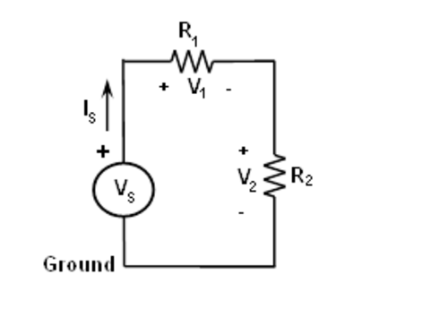

Spannungsteilung
================

Zielsetzung
-----------
Das Ziel dieser Labortätigkeit ist die Überprüfung der
Spannungsteilungseigenschaften von Widerstandsnetzwerken.

.. note:: In diesen Tutorials verwenden wir die Terminologie aus dem
	  Benutzerhandbuch, wenn es um die Verbindungen zur Red Pitaya STEMlab
	  Board Hardware geht. Verlängerungsstecker-Pins, die als
	  5V-Spannungsquelle verwendet werden, sind in der Dokumentation hier
	  dargestellt.

Hintergrund
-----------
Die Spannungsteilung ermöglicht es uns, die Analyse eines
Schaltkreises zu vereinfachen. Die Spannungsteilung ermöglicht es uns,
zu berechnen, welcher Anteil der Gesamtspannung an einer Reihe von
Widerständen über einen einzelnen Widerstand abgefallen ist. Für die
Schaltung von :numref:`03_fig_01` lauten die Formeln der Spannungsteilung:

.. math:: V_1 = V_S \frac{R_1}{R_1 + R_2}
   :label: 03_eq_01

.. math:: V_2 = V_S \frac{R_2}{R_1 + R_2}
   :label: 03_eq_02

   

.. _03_fig_01:

   
   Spannungsteilung.

   
Materialien
-----------
- Red Pitaya STEMlab 125-14 oder STEMlab 125-10 

- Verschiedene Widerstände:
  
  - :math:`470\,\Omega`, 
    
  - :math:`1\,k\Omega`, 

  - :math:`4,7\,k\Omega`,
    
  - :math:`1,5\,k\Omega`.

Vorgehensweise
--------------

1. Bauen Sie die Schaltung  wie in Abb. 1 dargestellt auf. Setzen Sie
   :math:`R_1 = 4.7\,k\Omega`, :math:`R_2 = 1,5\,k\Omega` und verwenden
   Sie das feste Netzteil 5 V-Pin vom Erweiterungsstecker als
   Spannungsquelle :math:`V_s`\. Verwenden Sie die
   Oszilloskopanwendung, um die Spannungen :math:`V_1` und
   :math:`V_2` zu messen. Wiederholen Sie diesen Schritt für
   :math:`R_1 = R_2 = 4.7\,k\Omega` und notiere die Messergebnisse.
		   

2. Berechnen Sie die Spannungen :math:`V_1` und :math:`V_2`
   unter Verwendung der Gl. :eq:`03_eq_01` und :eq:`03_eq_02`.
   

3. Vergleichen Sie die Ergebnisse der Schritte 1. und 2.

