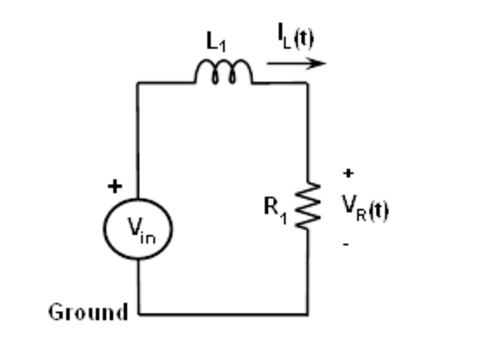
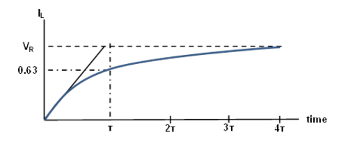
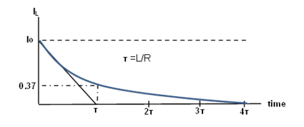

Transient Response einer RL-Schaltung
=====================================

Zielsetzung
-----------

Das Ziel dieser Labortätigkeit ist es, das transiente Verhalten von
Induktionsschaltungen mit einer RL-Konfiguration der Serie zu
untersuchen und das Konzept der Zeitkonstante zu verstehen.

.. note::

   .. _Hardware: https://redpitaya.readthedocs.io/en/latest/developerGuide/hardware.html

   In diesen Tutorials verwenden wir die Terminologie aus dem
   Benutzerhandbuch, wenn es um die Verbindungen zur Red Pitaya
   STEMlab-Board Hardware_ geht.

   Die Oszilloskop- und Signalgeneratoranwendung wird zum Erzeugen und
   Beobachten von Signalen auf der Schaltung verwendet.

   

Hintergrund
-----------

Diese Labortätigkeit ist ähnlich wie der Versuch 6, nur dass der
Kondensator durch eine Induktivität ersetzt wird. In diesem Experiment
wenden Sie eine rechteckige Wellenform auf die RL-Schaltung an, um das
transiente Verhalten der Schaltung zu analysieren. Die Impulsbreite in
Bezug auf die Zeitkonstante der Schaltung bestimmt, wie sie von der
RL-Schaltung beeinflusst wird.

Zeitkonstante :math:`\tau` : Es ist ein Maß für die Zeit, die für
bestimmte Änderungen von Spannungen und Strömen in RC- und RL-Kreisen
benötigt wird. Im Allgemeinen, wenn die verstrichene Zeit fünf
Zeitkonstanten (5 :math:`\tau` ) nach dem Schalten überschreitet,
haben die Ströme und Spannungen ihren Endwert erreicht, der auch als
stationäre Reaktion bezeichnet wird.

 
Die Zeitkonstante einer RL-Schaltung ist die äquivalente Induktivität
dividiert durch den Thévenin-Widerstand, bezogen auf die Anschlüsse
des äquivalenten Gleichstromkreises.

.. math::
   :label: 07_eq_01
	   
	   f=\frac{L}{R} 

	   
Ein Impuls ist eine Spannung oder ein Strom, der von einem Niveau zum
anderen und wieder zurück wechselt. Wenn die hohe Zeit einer
Wellenform gleich ihrer niedrigen Zeit ist, wird sie als Rechteckwelle
bezeichnet. Die Länge eines jeden Zyklus einer Impulsfolge ist seine
Periode (T). Die Impulsbreite (tp) einer idealen Rechteckwelle
entspricht der Hälfte der Zeitspanne.

Das Verhältnis zwischen Impulsbreite und Frequenz für die
Rechteckwelle wird durch die folgende Gleichung beschrieben:

 
.. math::
   :label: 07_eq_02

	   f = \frac{1}{2t_p} 
	

.. _07_fig_01:

	   Serien-RL-Schaltung

	   
In einem RL-Kreis nimmt die Spannung über der Spule mit der Zeit ab,
während in dem RC-Kreis die Spannung über dem Kondensator mit der Zeit
zunimmt. Somit hat der Strom in einer RL-Schaltung die gleiche Form
wie die Spannung in einer RC-Schaltung: Sie steigen beide exponentiell
auf ihren Endwert an.

Der Ausdruck für den Strom in der Spule ist gegeben durch:

.. math::
   :label: 07_eq_03
	
	I_L(t) = R V \left(1 - e^{-\frac{R}{L}t} \right), \quad t >= 0
	

wobei V die an die Schaltung angelegte Quellspannung für t = 0 ist,
die Ansprechkurve steigt und ist in Figur 2 dargestellt.

.. _07_fig_02:

	   Der Strom in der Spule steigt in einem Serien-RL-Kreis an.
	   (Zeitachse normiert um t.) 

	   
Der Ausdruck für den Stromabfall über der Spule wird durch: 
 
.. math::
   :label: 07_eq_04
 
	   I_L(t) = I_0 e^{- \frac{R}{L}t}, \quad t >= 0 

wo, I\ :sub:`0`\ der Anfangsstrom ist, der in der Spule bei t = 0
gespeichert ist. :math:`L/R = \tau` ist die Zeitkonstante. 
 
Die Reaktionskurve ist eine abklingende Exponentialfunktion und ist in
:numref:`07_fig_03` dargestellt.

.. _07_fig_03:

	   
Da es nicht möglich ist, den Strom durch die Spule direkt zu messen
(Strom, der von OUT1 geliefert wird), wird die Ausgangsspannung über
den Widerstand in Reihe mit der Spule gemessen. Die Wellenform des
Widerstandes wird die gleiche Form wie der Spulestrom haben, da wir
aus dem ohmschen Gesetz wissen, dass Strom und Spannung durch den
Widerstand mit V :sub:`R` = I :sub:`R` * R verbunden sind. Unsere
Schaltung hat zwei Elemente (Widerstand und Spule) in Reihe, was
bedeutet, dass der gleiche Strom durch beide Komponenten fließt I
:sub:`Schaltung` = I :sub:`L` = I :sub:`R`. Wir wissen, dass das
Signal am Eingang IN2 eine Spannung über dem Widerstand V
:sub:`R` ist und damit der Strom durch die Spule multipliziert
mit dem Widerstand R.
	  

.. math::
   :label: 07_eq_05
	   
	   IN2 = R \cdot I_L 

	   
Daraus folgt, dass wir bei der Beobachtung des Signals IN2 den Strom
durch den Spule beobachten, und das Einzige, was wir beachten müssen,
ist der Skalierungsfaktor - Widerstand R.

     
Aus den Wellenformen des Scopes sollten wir die Zeitkonstante
:math:`\tau` messen können, die gleich :math:`\tau` = L / R
:sub:`total` sein sollte. Hier ist R :sub:`total` der
Gesamtwiderstand und kann aus R :sub:`total` = R
:sub:`Spule` + R berechnet werden.
		
Der Wert für R :sub:`Spule` ist der Messwert des
Induktionswiderstandes und kann mit einem Multimeter vor der
Durchführung des Experiments gemessen werden. (Messen Sie die R
:sub:`Spule` genauso, wie Sie den normalen Widerstand messen würden.)
     

Materialien
-----------

Red Pitaya STEMlab 125-14 oder STEMlab 125-10 

- Widerstand :math:`R = 220\,\Omega`

- Spule :math:`L = 20\,mH`

  
Vorgehensweise
--------------

1. Messen Sie den kombinierten Spule- und Widerstandswiderstand R \
   :sub:`total` \ mit einem Multimeter.
	
   .. _07_fig_04:   
   .. figure:: img/Activity_07_Fig_04.png

	       Versuchsaufbau 

	       
2. Bauen Sie die in Abbildung 5 dargestellte Schaltung auf Ihrer
   lötfreien Leiterplatte mit den Bauteilwerten R :sub:`1` = 220 :math:`\Omega` und
   L :sub:`1` = 20mH auf.
   
   
   - Schließen Sie die Sonden des Oszilloskops und des
     Signalgenerators wie in Abbildung 5 dargestellt an.
     
     - Stellen Sie die Oszilloskop-Dämpfung auf x1 ein.
   
       Starten Sie die Anwendung Oszilloskop & Signalgenerator.

       
3. Im Einstellungsmenü OUT1 den DC-Offsetwert auf 0,5 und den
   Amplitudenwert auf 0,5V einstellen, um eine 1Vp-p Rechteckwelle mit
   einer Zentrierung von 0,5 V als Eingangsspannung für die Schaltung
   anzulegen. Wählen Sie aus dem Wellenform-Menü SQUARE-Signal,
   deaktivieren Sie die SHOW-Taste und aktivieren Sie Enable. Stellen
   Sie sicher, dass IN1 V/div und IN2 V/div beide auf 200mV/div
   eingestellt sind (Sie können V/div einstellen, indem Sie den
   gewünschten Kanal auswählen und vertikale +/- Regler verwenden). Im
   Einstellungsmenü IN1 und IN2 den Wert des vertikalen Versatzes
   auf -500mV einstellen. Für die stabile Aufnahme stellen Sie den
   Triggerpegel im TRIGGER-Menü auf 0,5V und wählen Sie NORMAL.
   

   Berechnen Sie die angewandte Frequenz nach Gleichung (2) für tp = 5
   :math:`\tau`. Im Menü OUT1 die Frequenz entsprechend der Berechnung
   einstellen.
	 

   Stellen Sie die Zeitbasis mit der horizontalen +/- Steuerung so
   ein, dass Sie etwa zwei Zyklen der Rechteckwelle auf dem
   Anzeigegitter haben.
   

4. Die V :sub:`R` (IN2) Wellenform hat die gleiche Form wie die I
   :sub:`L` (t) Wellenform. Messen Sie aus V :sub:`R` die
   Zeitkonstante :math:`\tau` und vergleichen Sie sie mit
   derjenigen, die Sie aus L/R :sub:`total` berechnet haben.
	

.. hint:: Bei der Messung des RC-Transienteneffekts haben wir den
	  Cursor verwendet, um 0,63*Vc zu finden, hier interessieren
	  wir uns für den Strom I :sub:`L` = IN2/R und nicht für die
	  Spannung. Gemäß der Abbildung 3 sollten Sie den Cursor Y1
	  auf den Maximalwert von IN2 und den Cursor Y2 auf den Wert
	  0,37*IN2 stellen. Die Cursor X1 und X2 auf die
	  Kreuzungspunkte einstellen und die Zeitkonstante messen.
	  

   Zur Bestimmung der Zeitkonstante verwenden Sie die Option
   "CURSOR". Öffnen Sie das Menü CURSOR und wählen Sie alle vier
   Cursor aus: X1, X2, Y1, Y2. Für den Y-Cursor wählen Sie IN2 für die
   Quelle. Steuern/Bewegen von Cursorn mit einem
   Linksklick+Maussteuerung auf der Cursor-Markierung (ein Pfeil am
   Ende der Cursorlinie).
   
   Um die Cursor genauer einzustellen, stellen Sie die Zeitbasis ein,
   bis Sie etwa eine oder die Hälfte des Zyklus der Rechteckwelle auf
   dem Anzeigegitter haben.

	  

5. Beobachten Sie die Reaktion der Schaltung und notieren Sie die
   Ergebnisse erneut für tp = 25 :math:`\tau` und tp = 0,5
   :math:`\tau`.
	 

Fragen
------

- Fügen Sie Diagramme von I :sub:`L` und V :sub:`R` für verschiedene
  tp-Werte hinzu, die oben in Verfahren 4 beschrieben sind.
  
- Ein Kondensator speichert die Ladung. Was denkst du, was eine Spule
  speichert? Antworte kurz.
  
