Tiefpass- und Hochpassfilter
============================

Zielsetzung
-----------

Das Ziel dieser Labortätigkeit ist es, die Eigenschaften von passiven Filtern zu untersuchen, indem man den Frequenzgang von Tiefpass- RC-Filter und Hochpass- RL-Filter erhält.  

Notizen
-------

.. _hardware: https://redpitaya.readthedocs.io/en/latest/developerGuide/hardware.html
.. _Oscilloscope: http://redpitaya.readthedocs.io/en/latest/doc/appsFeatures/apps-featured/oscSigGen/osc.html
.. _Bode: http://redpitaya.readthedocs.io/en/latest/doc/appsFeatures/apps-featured/bode/bode.html
.. _Signal: http://redpitaya.readthedocs.io/en/latest/doc/appsFeatures/apps-featured/oscSigGen/osc.html
.. _generator: http://redpitaya.readthedocs.io/en/latest/doc/appsFeatures/apps-featured/oscSigGen/osc.html

In diesen Tutorials verwenden wir die Terminologie aus dem Benutzerhandbuch.
wenn es um die Anschlüsse an die Red Pitaya STEMlab-Karte geht.
hardware_.

Die Anwendung Oscilloscope_ & Signal_ Generator_ wird zur Erzeugung von
und Beobachten von Signalen auf dem Schaltkreis. Bode_ Analysator Anwendung ist
wird zur Messung des Frequenzgangs von Tiefpass- und Hochpassfiltern verwendet. 

Hintergrund
-----------

Die Impedanz einer Induktivität ist proportional zur Frequenz und die Impedanz eines Kondensators ist umgekehrt proportional zur Frequenz. Mit diesen Eigenschaften können bestimmte Frequenzen eines Eingangssignals ausgewählt oder abgelehnt werden. Diese Auswahl und Ablehnung von Frequenzen wird als Filter bezeichnet, und eine Schaltung, die dies tut, wird als Filter bezeichnet. 

.. _09_fig_01:
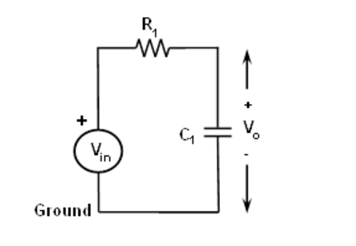

	    Tiefpassfilter RC.

.. _09_fig_02:   
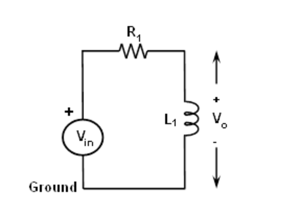

	    Hochpass-RL-Filter.

   
Wenn ein Filter hohe Frequenzen passieren lässt und tiefe Frequenzen ablehnt, dann ist es ein Hochpassfilter. Umgekehrt, wenn es niedrige Frequenzen passieren lässt und hohe Frequenzen ablehnt, ist es ein Tiefpassfilter. Filter sind, wie die meisten elektronischen Schaltungen, nicht perfekt. Sie lassen nicht unbedingt einige Frequenzen passieren und lehnen andere absolut ab. Eine Frequenz gilt als passierbar, wenn ihre Größe (Spannungsamplitude) innerhalb von 70% oder :math:`1/sqrt(2)` der maximal gemessenen Amplitude liegt und anderweitig abgelehnt wird. Die 70%ige Frequenz wird als Eckfrequenz, Roll-off-Frequenz oder Halbleistungsfrequenz bezeichnet.

Die Eckfrequenzen für RC-Filter und RL-Filter sind wie folgt:

Für RC-Filter: 

.. math::
   
   f_c = \frac{1}{2 \pi RC} (1)
   
Für RL-Filter: 

.. math::	

   f_c = \frac{R}{2 \pi L} (2) 

Frequenzgang: Es ist ein Diagramm der Größe der Ausgangsspannung des Filters in Abhängigkeit von der Frequenz. Es wird im Allgemeinen verwendet, um den Frequenzbereich zu charakterisieren, in dem der Filter für den Betrieb im Inneren ausgelegt ist. 

.. _09_fig_03:
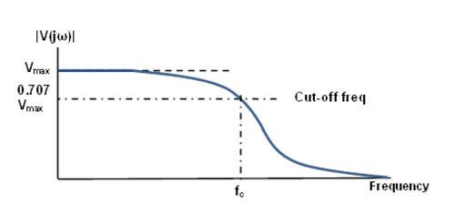

	    Frequenzgang eines typischen Tiefpassfilters mit einer Grenzfrequenz fc

   
Materialien:
------------

- Red Pitaya STEMlab 125-14 oder STEMlab 125-10 
- Widerstände: 1 :math:`k\Omega` 
- Kondensatoren: 1 µF
- Induktivität/Spule: 22 mH 

  
Vorgehensweise
--------------

***RC-Tiefpassfilter:***

1. Bauen Sie die RC-Schaltung wie in Abbildung 1 auf Ihrer lötfreien
   Leiterplatte mit den Bauteilwerten :math:`R_1 = 1 k\Omega`,
   :math:`C_1 = 1 \mu F` auf.
   

2. Verbinden Sie die STEMlab-Board mit Ihrer Schaltung:

   - Schließen Sie die Sonden des Oszilloskops und des
     Signalgenerators wie in Abbildung 4 dargestellt an.
     

   - Stellen Sie die Oszilloskopdämpfung auf x1 ein.

.. _09_fig_04:     
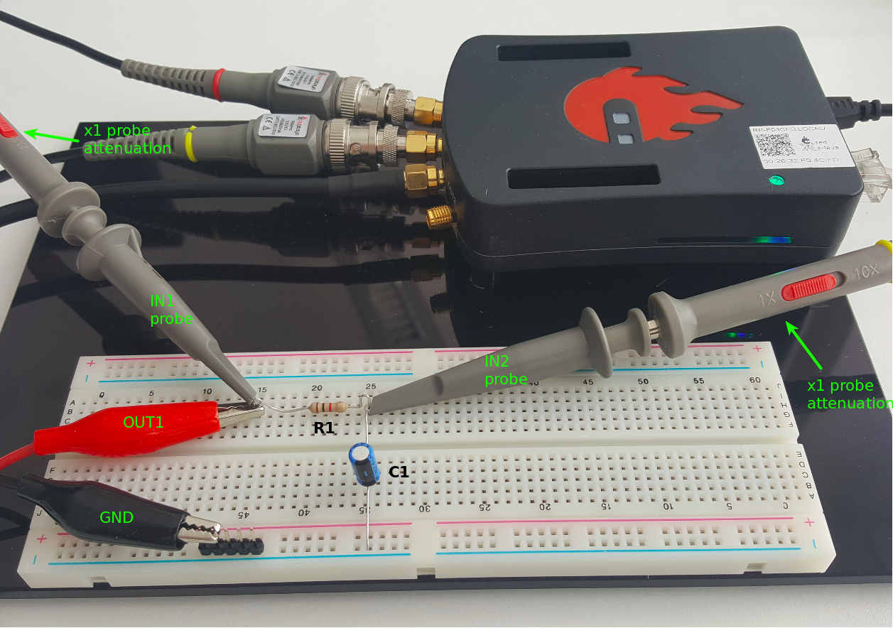

   Tiefpass RC-Filter Breadboard-Schaltung

   
3. Starten Sie die Anwendung Oszilloskop & Signalgenerator:
   Im Einstellungsmenü OUT1 den DC-Offsetwert auf 0,5 und den Amplitudenwert auf 0,5V einstellen,
   um eine 1Vp-p Sinuskurve mit Zentrierung auf 0,5 V als Eingangsspannung für die Schaltung anzulegen.
   Wählen Sie im Wellenform-Menü SINE-Signal, deaktivieren Sie die SHOW-Taste und wählen Sie Enable.
   Stellen Sie sicher, dass IN1 V/div und IN2 V/div beide auf 200mV/div eingestellt sind
   (Sie können V/div einstellen, indem Sie den gewünschten Kanal auswählen und die vertikalen +/- Regler verwenden).
   Stellen Sie im Einstellungsmenü IN1 und IN2 den Wert des vertikalen Versatzes auf -500mV ein.
   Für die stabile Erfassung stellen Sie den Triggerpegel im TRIGGER-Menü auf 0,5V ein und wählen Sie NORMAL.

4. Beginnen Sie mit einer niedrigen Frequenz, z.B. 50 Hz, und schauen Sie sich die Ausgangsspannung
   IN1 Spitze-Spitze auf dem Scopbildschirm an. Diese sollte mit dem Ausgang Kanal OUT1 identisch sein.
   Erhöhen Sie die Frequenz von OUT1 in kleinen Schritten, bis die Spitzenspannung des Kanals IN2 etwa
   das 0,7-fache der Spitzenspannung für Kanal IN1 beträgt. Berechnen Sie die 70 % von Vp-p und vergleichen Sie diese
   mit der Frequenz des Oszilloskops. .
   
   Daraus ergibt sich die Grenzfrequenz (Roll-off) für den konstruierten RC-Tiefpassfilter.
   Wenn Sie die Frequenz OUT1 ändern, stellen Sie die Zeit/Division mit den horizontalen -/+ Reglern ein.
   Für die Spitzenwertmessung wählen Sie im Messmenu "P2P", aktivieren IN1 und IN2 und drücken Sie DONE.

.. _09_fig_05:
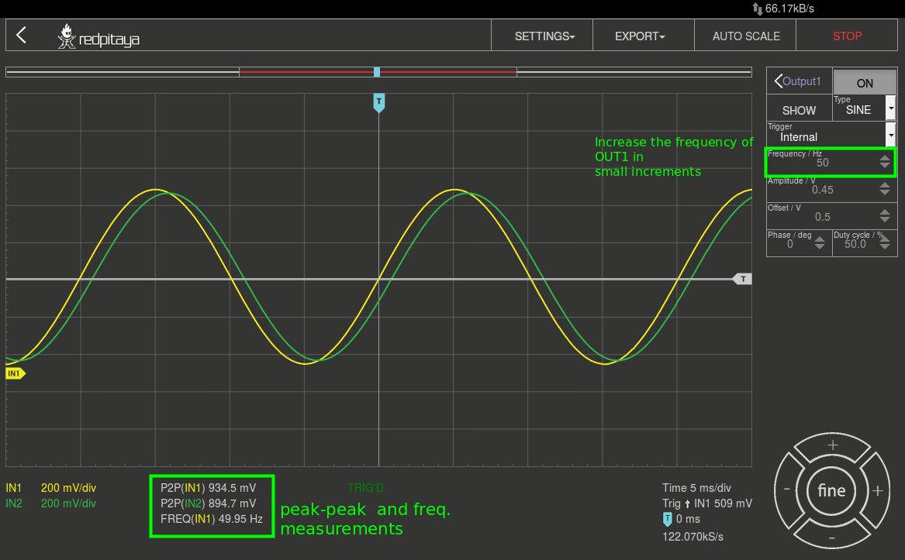

	    Tiefpass RC-Filterreaktion bei 50Hz

.. _09_fig_06:   
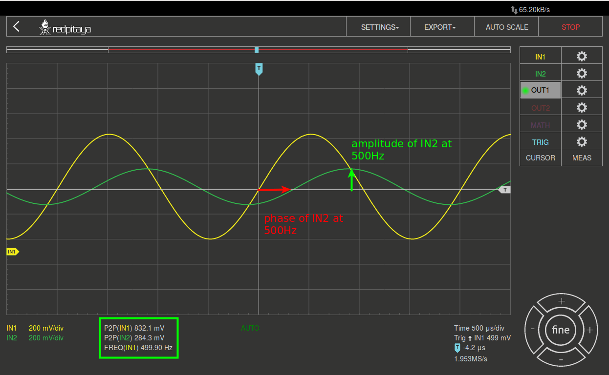

   Tiefpass RC-Filterreaktion bei 500Hz

   
RL-Hochpassfilter:**RL-Hochpassfilter:**

1. Bauen Sie den RL-Schaltkreis wie in Abbildung 2 auf Ihrem lötfreien
   Breadboard, mit den Komponentenwerten R1 = 1 :math:`k\Omega`, L1 = 22 mH auf.
   
2. Verbinden Sie die STEMlab-Board mit Ihrer Schaltung:

   - Schließen Sie die Sonden des Oszilloskops und des Signalgenerators wie in Abbildung 7 dargestellt an. 

   - Stellen Sie die Oszilloskopdämpfung auf x1 ein.

.. _09_fig_07:     
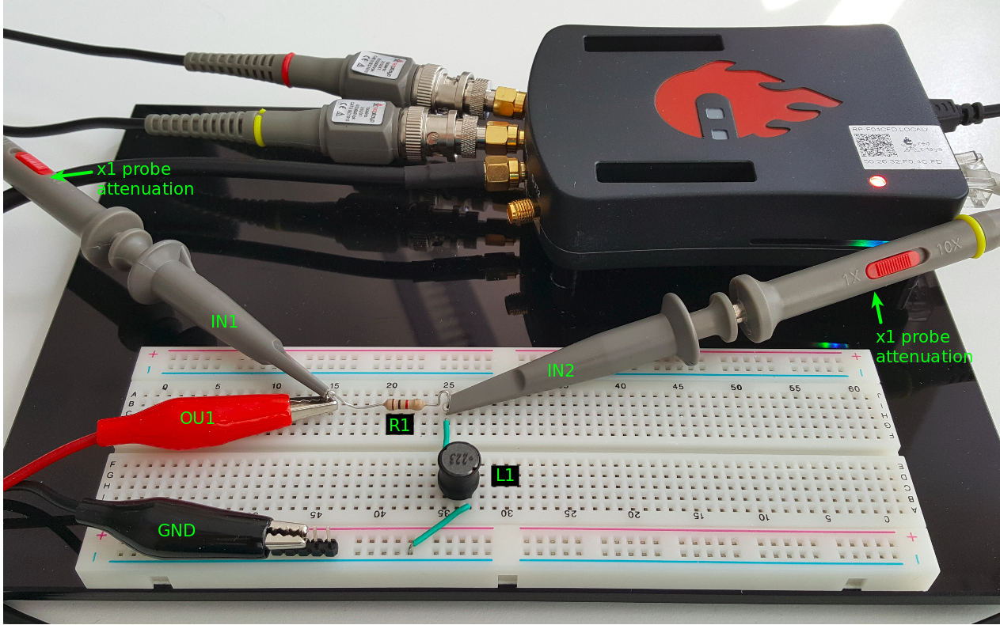

   Hochpass RL-Filter Breadboard-Schaltung

   
3. Beginnen Sie mit einer hohen Frequenz von ca. 50 KHz und messen Sie die
   Ausgangsspannung IN2 Spitze-Spitze mit der Oszilloskop-Anwendung.
   Sie sollte mit der Vp-p des Kanals IN1 identisch sein. Senken Sie die Frequenz des
   Kanals OUT1 in kleinen Schritten, bis die Spitzenspannung des Kanals IN2 etwa das
   0,7-fache der Spitzenspannung für Kanal IN1 beträgt. Berechnen Sie die 70 % von Vp-p
   und vergleichen Sie die Frequenz, mit der des Oszilloskops. Daraus ergibt sich
   die Grenzfrequenz (Roll-off) für den konstruierten Hochpass-RL-Filter.

.. _09_fig_08:
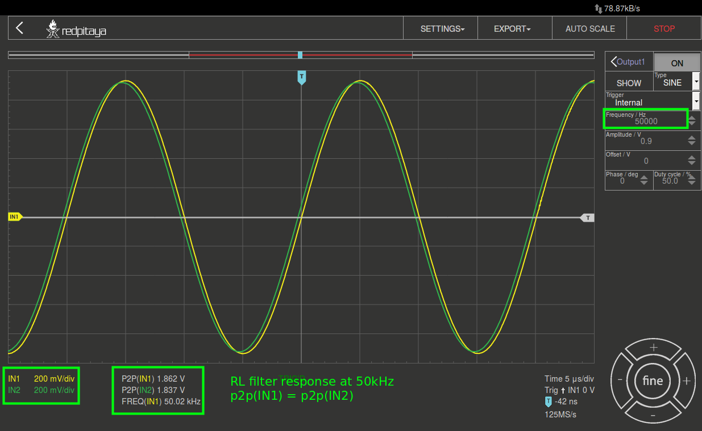

   Hochpass-RL-Filterreaktion bei 50kHz

.. _09_fig_09:    
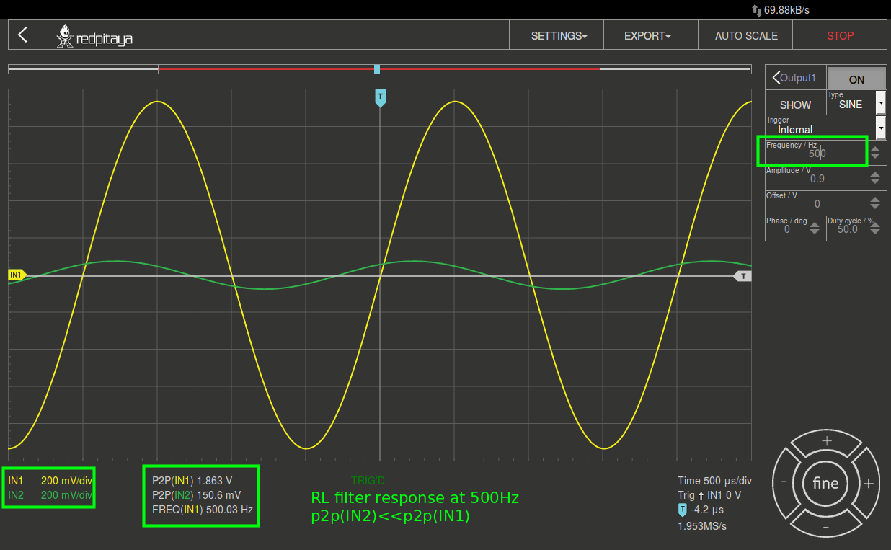

   Hochpass-RL-Filterreaktion bei 500Hz

   
Frequenzgang-Diagramme mit Bode Analayzer**

Die Bode-Analysatoranwendung führt einen Frequenzdurchlauf durch, so dass diese ein Sinussignal auf OUT1 innerhalb des von uns gewählten Frequenzbereichs (im Einstellungsmenü) erzeugt. Das Eingangssignal IN1 ist direkt mit OUT1 verbunden, also folgt daraus IN1=Vin. IN2 wird auf der anderen Seite des RL(RC)-Filters angeschlossen, so dass daraus IN2=Vout folgt. Die Anwendung des Bode-Analysators nimmt dann für jeden Frequenzschritt das Verhältnis von IN1/IN2 auf und berechnet daraus den Frequenzgang.

.. _09_fig_10:
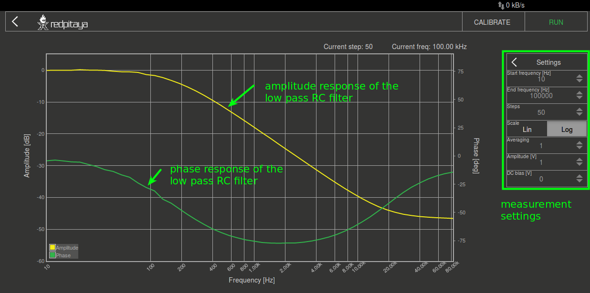

   Tiefpassfilterreaktion des RC-Filters mit der Bode-Analysatoranwendung

.. _09_fig_11:   
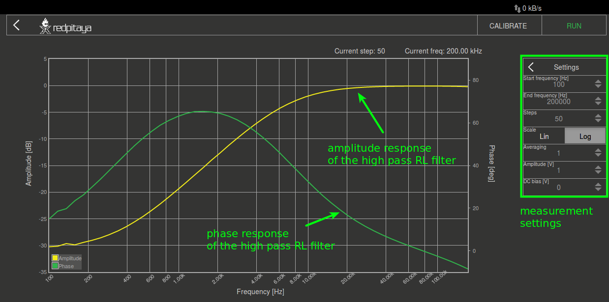

   Hochpass-RL-Filterreaktion mit der Bode-Analysatoranwendung

   
Fragen
------
Berechnen Sie die Grenzfrequenzen für den RC-Tiefpass und RL-Hochpassfilter mit den Gleichungen (1) und (2). Vergleichen Sie die berechneten theoretischen Werte mit denen aus den experimentellen Messungen und geben Sie eine geeignete Erklärung für eventuelle Unterschiede.

