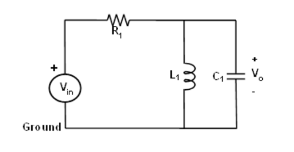
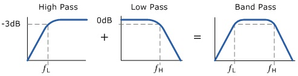
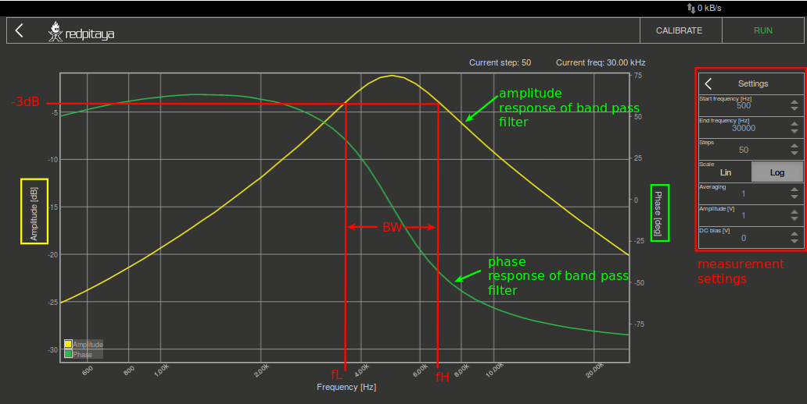

Bandpassfilter
==============

Zielsetzung
-----------

Das Ziel dieser Labortätigkeit ist es,: 

1. Konstruieren Sie einen Bandpassfilter, indem Sie einen Tiefpassfilter und einen Hochpassfilter kaskadieren. 

2. Erhalten Sie den Frequenzgang des Filters mit Hilfe der Anwendung Bode_ analyzer.

Notizen
-------

.. _Hardware: https://redpitaya.readthedocs.io/en/latest/developerGuide/hardware.html
.. _Bode: http://redpitaya.readthedocs.io/en/latest/doc/appsFeatures/apps-featured/bode/bode.html 

In diesen Tutorials verwenden wir die Terminologie aus dem Benutzerhandbuch.
wenn es um die Anschlüsse an die Red Pitaya STEMlab-Karte geht.
hardware_.

Die Bode_ Analysatoranwendung wird zur Messung des Frequenzgangs von
Tiefpass- und Hochpassfilter.

Der Bode Analysator ist eine ideale Anwendung zur Messung des Frequenzgangs der passiven/aktiven Filter, komplexer Impedanzen und anderer elektronischer Schaltungen. Der Gain/Phase Frequenzgang kann verwendet werden, um jedes zu testende Gerät vollständig zu charakterisieren, Sie können lineare und logarithmische Sweeps durchführen. Verstärkung und Phase können von 1Hz bis 60MHz gemessen werden. Die grundlegende Benutzeroberfläche ermöglicht eine schnelle Interaktion und Parametereinstellung. Der Bode Analysator kann zur Messung der Stabilität von Regelkreisen wie DC/DC-Wandler in Stromversorgungen, Einfluss der Terminierung auf Verstärker oder Filter, Ultraschall- und Piezoelektriksysteme und dergleichen verwendet werden.

Hintergrund
-----------

Ein Bandpassfilter lässt einen bestimmten Frequenzbereich passieren, während er niedrigere und höhere Frequenzen blockiert oder dämpft. Er überträgt Frequenzen zwischen den beiden Grenzfrequenzen und dämpft Frequenzen außerhalb der Grenzfrequenzen. Eine typische Anwendung eines Bandpassfilters ist die Audiosignalverarbeitung, bei der ein bestimmter Frequenzbereich des Klangs gewünscht wird, während der Rest abgeschwächt wird. Eine weitere Anwendung ist die Auswahl eines bestimmten Signals aus einer Reihe von Signalen in Kommunikationssystemen. Ein Bandpassfilter kann durch Kaskadierung eines Hochpass-RL-Filters mit einer Roll-Off-Frequenz :math:`f_L` und eines Tiefpass-RC-Filters mit einer Roll-Off-Frequenz :math:`f_H` aufgebaut werden, so dass:

.. math::	

   f_L < f_H 

Die untere Grenzfrequenz wird als: 

.. math::	

   f_L = \frac{R}{2 \pi L} \quad (1)

Die höhere Grenzfrequenz wird als: 

.. math::

   f_H = \frac{1}{2 \pi RC} \quad (2) 

Die **Bandbreite** der übergebenen Frequenzen wird durch: 

.. math::

   BW = f_L < f_{BW} < f_H \quad (3) 

Alle Signalfrequenzen :math:`f` unterhalb :math:`f_L` und oberhalb
:math:`f_H` werden gedämpft und die Frequenzen dazwischen werden vom Filter durchgelassen. 
      
.. _10_fig_01:

   Bandpass-Filterschaltung 

   
Frequenzgang
------------

Um zu zeigen, wie eine Schaltung auf einen Frequenzbereich reagiert, kann ein Diagramm der Größe ("Amplitude") der Ausgangsspannung des Filters in Abhängigkeit von der Frequenz erstellt werden. Es wird im Allgemeinen verwendet, um den Frequenzbereich zu charakterisieren, in dem der Filter für den Betrieb im Duchlass ausgelegt ist. Abbildung 2 zeigt einen typischen Frequenzgang eines Bandpassfilters.

.. _10_fig_02:

   Bandpassfilter Frequenzgang

   
Materialien:
------------

- Red Pitaya STEMlab 125-14 oder STEMlab 125-10 

- Widerstand: 1 :math:`k\Omega` 

- Kondensator: 0,047 µF

- Induktor: 22 mH 

Vorgehensweise
--------------

1. Bauen Sie den Filterschaltkreis nach Abbildung 1 und Abbildung 3 auf Ihrer
   lötfreie Lochrasterplatine mit den Bauteilwerten R1 = 1 :math:`k\Omega`, C1 =
   0,047 µF, L1 =22 mH auf.

   .. _10_fig_03:
   .. figure:: img/Activity_10_Fig_03.png

	       Bandpassfilter auf lötfreier Leiterplatte

2. Starten Sie die Anwendung Bode analyzer. Die Bode-Analysatoranwendung
   führt einen Frequenzdurchlauf durch, so dass sie ein Sinussignal auf :math:`OUT1`
   innerhalb des von uns gewählten Frequenzbereichs (im Einstellungsmenü) erzeugt.
   Das Eingangssignal :math:`IN1` ist direkt mit :math:`OUT1` verbunden, gefolgt von :math:`IN1=V_{in}`.
   :math:`IN2` wird auf der anderen Seite des Filters und daraus :math:`IN2=V_{out}` angeschlossen.
   Die Anwendung des Bode-Analysators nimmt dann für jeden Frequenzschritt das
   Verhältnis von :math:`IN1/IN2` (:math:`V_{in}/V_{out}`) und berechnet den Frequenzgang.  

3. Im Menü Einstellungen des Bode-Analysators ist das Menü auf:

   - Startfrequenz: 500 Hz

   - Endfrequenz: 30 kHz

   - Anzahl der Schritte: 50

   - Skalierung: Log 

   - RUN-Taste auswählen

.. _10_fig_04:  

	       Bandpassfilter **gemessen** Frequenzgang

   
Fragen:
-------

1. Berechnen Sie die Grenzfrequenzen für jeden Teilfilter des Bandpasses, der unter Verwendung
   der Formel in den Gleichungen (1) und (2) konstruiert wurde. Vergleichen Sie diese
   theoretischen Werte mit denen aus dem Experiment und geben Sie eine geeignete
   Erklärung für eventuelle Unterschiede.

