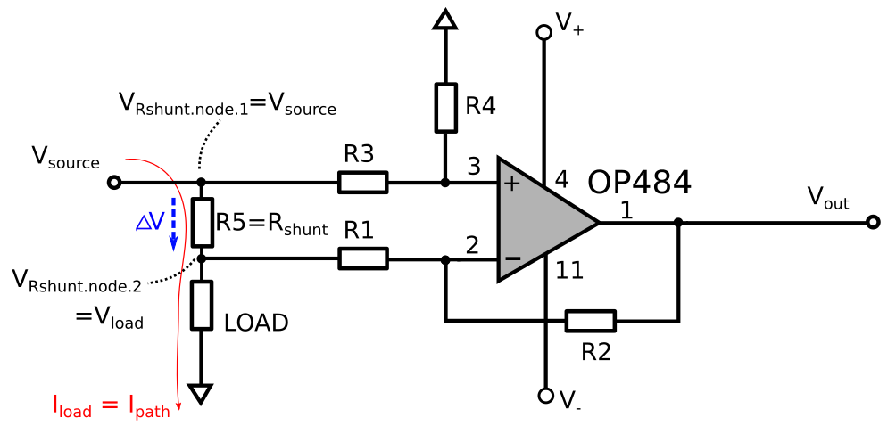
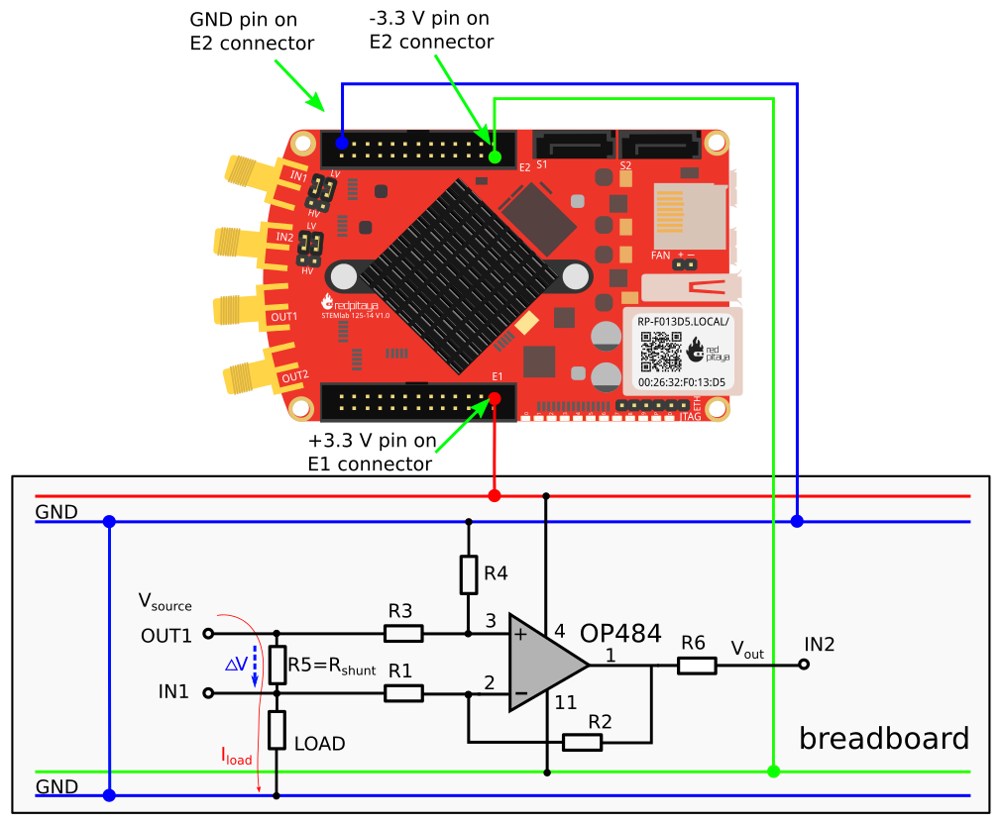
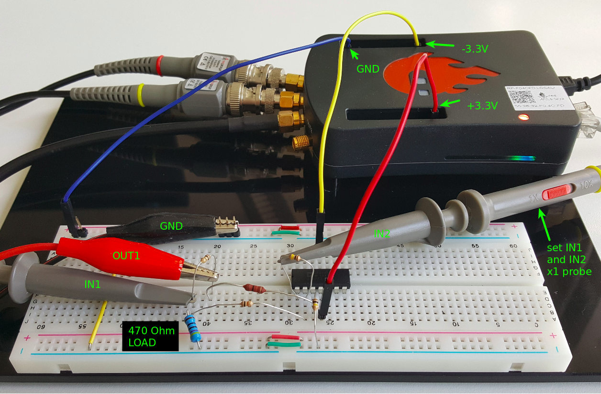
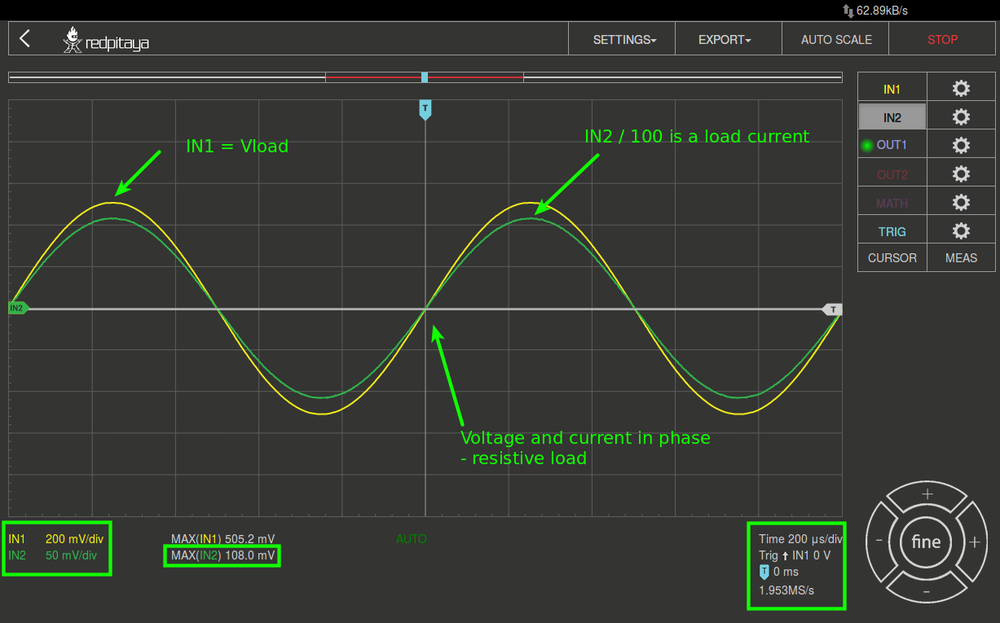
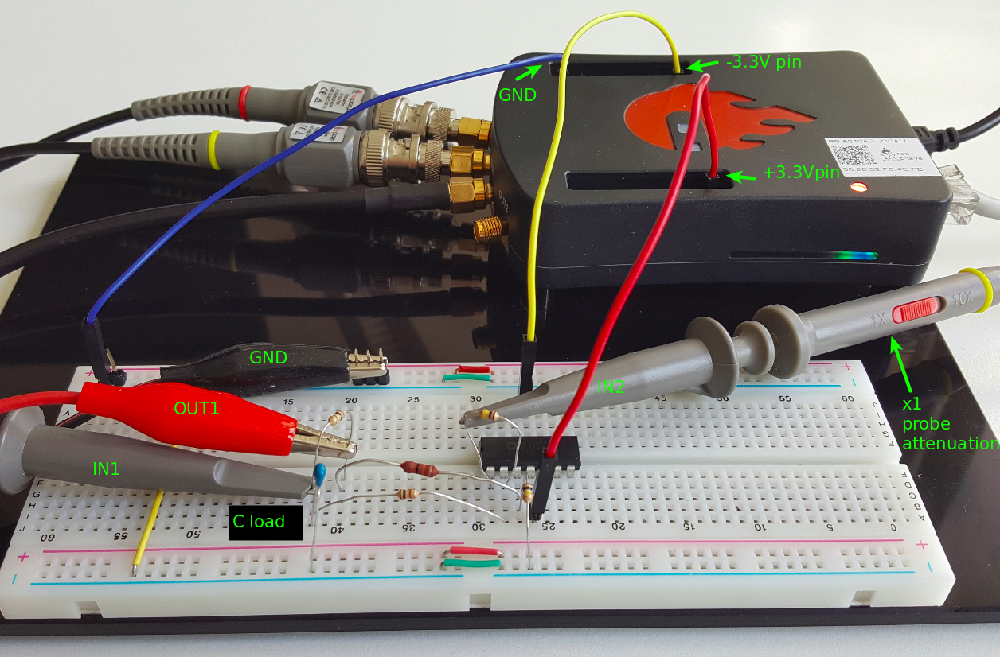
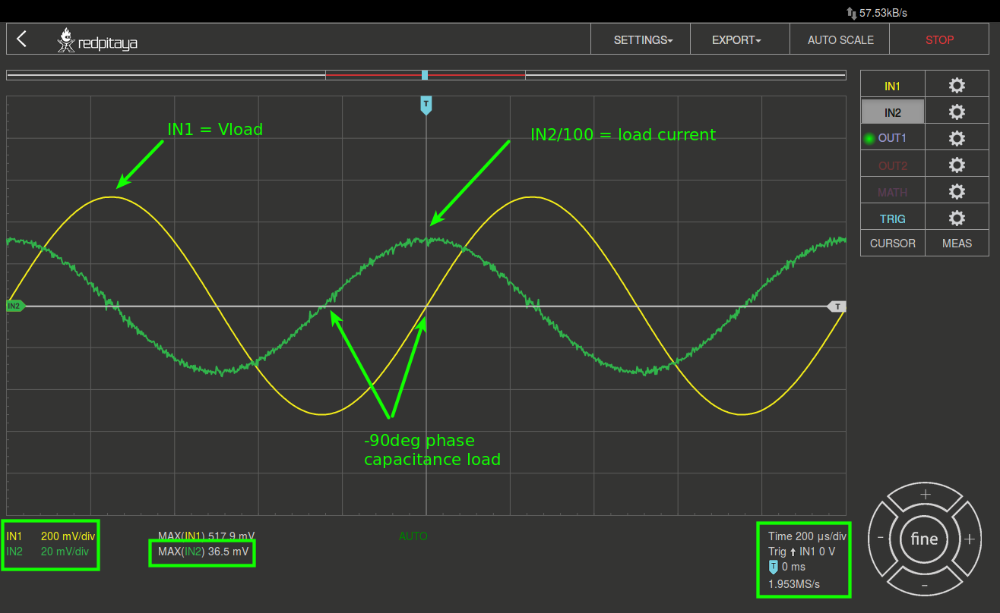
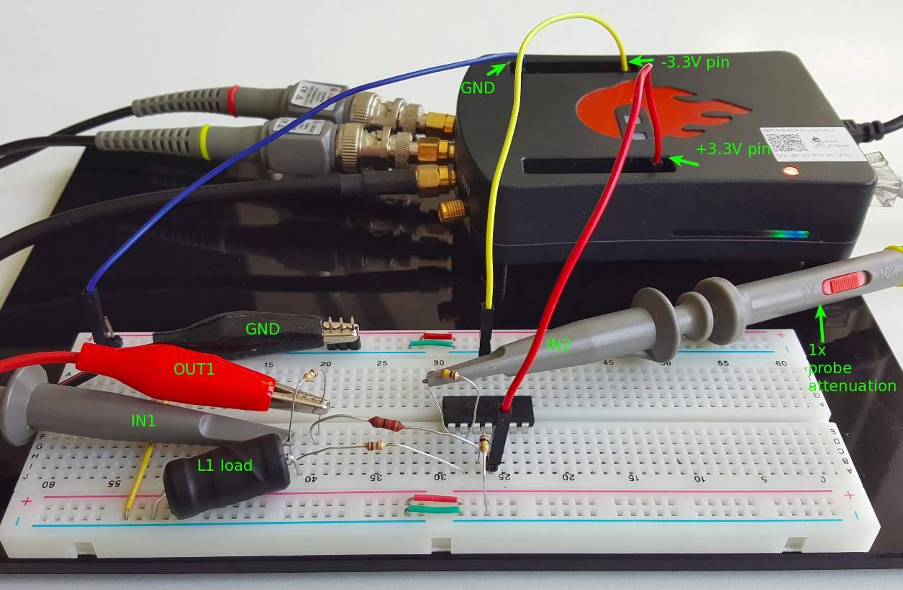
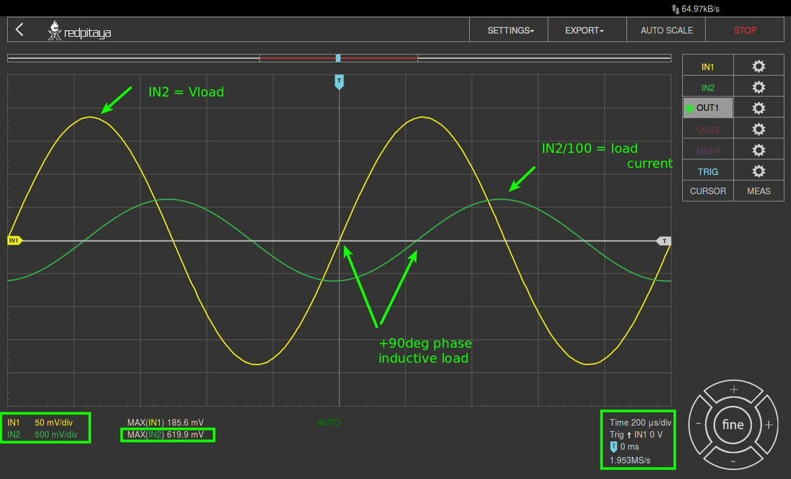

Strommessung mit einem Differenzverstärker
==========================================

Zielsetzung
-----------

Ziel dieser Labortätigkeit ist es, Strommesstechniken zu untersuchen,
die einen als Differenzverstärker konfigurierten Operationsverstärker
verwenden.

Anmerkungen
-----------

.. _Hardware: http://redpitaya.readthedocs.io/en/latest/doc/developerGuide/125-10/top.html
.. _Dokumentation: http://redpitaya.readthedocs.io/en/latest/doc/developerGuide/125-14/extt.html#extension-connector-e2
.. _Oszilloskop: http://redpitaya.readthedocs.io/en/latest/doc/appsFeatures/apps-featured/oscSigGen/osc.html
.. _Signal: http://redpitaya.readthedocs.io/en/latest/doc/appsFeatures/apps-featured/oscSigGen/osc.html
.. _Signalgeneratoranwendung: http://redpitaya.readthedocs.io/en/latest/doc/appsFeatures/apps-featured/oscSigGen/osc.html
.. _amplifier: http://red-pitaya-active-learning.readthedocs.io/en/latest/Activity_16_DifferenceAmplifier.html#difference-amplifier
.. _difference: http://red-pitaya-active-learning.readthedocs.io/en/latest/Activity_16_DifferenceAmplifier.html#difference-amplifier
.. _Differenzverstärker: http://red-pitaya-active-learning.readthedocs.io/en/latest/Activity_16_DifferenceAmplifier.html#difference-amplifier
.. _OP484: http://www.analog.com/media/en/technical-documentation/data-sheets/OP184_284_484.pdf

In diesen Tutorials verwenden wir die Terminologie aus dem
Benutzerhandbuch, wenn es um die Verbindungen zur Red Pitaya STEMlab
Board Hardware_ geht. Die Erweiterungsstecker-Pins für die
Spannungsversorgung **-3,3V** und **+3,3V** sind in der Dokumentation_
dargestellt. Die Oszilloskop_ - und Signalgeneratoranwendung_ wird zum
Erzeugen und Beobachten von Signalen auf der Schaltung verwendet.

Hintergrund
-----------

Wir haben den Differenzverstärker_ untersucht. Nun werden wir ihn als
Strommessverstärker verwenden. Eine der Hauptanwendungen des
Operationsverstärkers ist die Messung des Stroms an einem anderen
Punkt in einer Schaltung als dort, wo er in oder aus der Erde oder dem
gemeinsamen Knoten fließt. Der zu messende Strom wird durch Aufbrechen
des Strompfades und Reihenschaltung eines Niederohmwiderstandes in
eine kleine Spannung umgewandelt. Dieser Widerstand wird als
Stromshunt-Widerstand oder auch nur als Shunt bezeichnet. Der
Widerstand wird klein gehalten und der Spannungsabfall über dem Shunt
klein, um die Auswirkungen dieser Änderung auf den Betrieb der
Schaltung zu reduzieren. Der durch den Shunt-Widerstand fließende
Strom wird als Pfadstrom angegeben.

.. math::
   :label: 17_eq_1
     
   I_{Pfad} = I_{Shunt} = \frac{\Delta V}{R_{Shunt}}

    
Da die Differenzspannung am Widerstand, gegeben als
:math:`\Delta V = V_{R_{shunt_{Knoten_1}}}-V_{R_{shunt_{Knoten_2}}}`,
gemessen werden sollte, können wir sehen, dass ein Differenzverstärker
ist eine ideale Schaltung für diese Aufgabe. Der kleine differentielle
Spannungsabfall über den Shunt wird verstärkt und durch einen
Operationsverstärker in eine einseitige (gemeinsam referenzierte)
Spannung umgewandelt. 

   Basis-Differenzverstärker in der Stromsensorkonfiguration

Aus der :numref:`17_fig_01` wissen wir, dass die als :math:`Delta V =
I_L R_s` angegebene Differenzspannung :math:`Delta V` Informationen
über den Laststrom enthält. Auch aus der Differenzverstärker-Theorie
wissen wir, dass :math:`\Delta V` irgendwie mit dem :math:`V_ {out}`
zu tun haben wird. Die erste Annahme ist wie folgt:

.. math::
   
   V_{out} \propto \Delta V = I_L R_s

oder

.. math::
   
   I_L \propto \frac{V_ {out}}{R_s}

    
Mit anderen Worten: durch einfaches Messen und Skalieren von
:math:`V_{out}` werden wir den Laststrom messen, wobei :math:`R_s` ein
Nebenwiderstand ist. Übertragungscharakteristik des
Differenzverstärkers für die in :numref:`17_fig_01` dargestellte
Schaltung ist:
      

.. math::
   :label: 17_eq_2
   
   V_{out} = V_{+} \left(1 + \frac{R_2}{R_1} \right) - V_{-} \left(\frac{R_2}{R_1} \right) 

Dabei sind :math:`V_{+}` und :math:`V_{-}` Spannungen an
nicht-invertierenden (Pin 3) bzw. invertierenden (Pin 2)
Operationsverstärkerseingängen. Setzen wir nun :math:`V_{+}` und
:math:`V_{-}` für Spannungen an Shunt-Widerstandsknoten erhalten wir
      

.. math::
   :label: 17_eq_3
   
   V_{out} = V_S \left( \frac{R_4}{R_3 + R_4} \right) \left(1 + \frac{R_2}{R_1} \right) - V_L \left( \frac{R_2}{R_1} \right)

wobei :math:`V_S` ist die Quellspannung und :math:`V_L` Lastspannung ist. Wir können auch schreiben

.. math::

   V_S = V_{R_{shunt_{Knoten_1}}}

   V_L = V_{R_{shunt_{Knoten_2}}}

und

.. math::

   V_S = V_L + \Delta V

   \Delta V = V_S - V_L

   
Auf den ersten Blick, durch das Hinzufügen des Widerstandes
:math:`R_4` zur Schaltung, wie in :numref:`17_fig_01` dargestellt,
haben wir irgendwie eine komplizierte Übertragungsfunktion; von
Gleichung (2) zu Gleichung (3). Aber das Hinzufügen von
:math:`R_4` ist notwendig, um den Faktor :math:`1+R_2/R_1` zum
Faktor :math:`R_2/R_1` aus der Gleichung (2)
auszugleichen, um die Eingangsspannungen der
Operationsverstärker gleichmäßig zu verstärken und somit
eine einfache :math:`\Delta V` zu :math:`V_{out}`
Korrelation zu ermöglichen. Der wichtige Schritt ist die
Auswahl der Werte von :math:`R_3` und :math:`R_4` als
	    

.. math::

   R_4 = R_2 \quad R_3 = R_1

   
Mit den obigen Gleichungen können wir Gleichung (3) wie folgt schreiben

.. math::
   :label: 17_eq_4
	   
   V_{out} = V_S \left(\frac{R_2}{R_1 + R_2} \right) \left(1 + \frac{R_2}{R_1} \right) - V_L \left( \frac{R_2}{R_1} \right)
   
   V_{out} = V_S \left( \frac{R_2}{R_1 + R_2} + \frac{R_2R_2}{R_1(R_1 + R_2)} \right) - V_L \left( \frac{R_2}{R_1} \right)

   
Sie besagt, dass

.. math::

   \left( \frac{R_2}{R_1 + R_2} + \frac{R_2R_2}{R_1(R_1 + R_2)} \right) = \frac{R_2}{R_1}

     
So können wir Gleichung (4) einfach schreiben als:

.. math::
   :label: 17_eq_5
	   
   V_{out} = V_S \left( \frac{R_2}{R_1} \right) - V_L \left(\frac{R_2}{R_1} \right)

   
Jetzt haben wir eine einfache Gleichung (5) für unseren
Differenzverstärker aus :numref:`17_fig_01` und der letzte Schritt
ist, ihn in Bezug auf :math:`\Delta V` umzuschreiben, d.h. in Bezug
auf :math:`I_L`.

.. math::
   :label: 17_eq_6

   V_{out} = \left( \frac{R_2}{R_1} \right) (V_S-V_L)
   
   V_{out} = \frac{R_2}{R_1} \Delta V 
 
   V_{out} = \frac{R_2}{R_1} I_L R_S

.. note::

   Und für :math:`I_L` bekommen wir:

   .. math:: I_L = V_{Aus} \frac{R_1}{R_2 R_S}
      :label: 17_eq_7

	
In unserem Beispiel haben wir
-----------------------------

- Widerstände:
   
   - :math:`R_4 = R_2 = 100k\Omega,`
   - :math:`R_3 = R_1 10k\Omega,`
   - :math:`R_2/R_1 = 10,`
   - :math:`R_S = R_5 = 10\Omega,`

     
- Spulestrom: :math:`I_L = \frac{V_{out}}{10R_S}.`

   
.. note::
   
   In unserem Beispiel wird der Laststrom wie folgt angegeben:

   .. math:: I_L = \frac{V_{out}}{100}
      :label: 17_eq_8

      
Materialien
-----------

- Rotes Pitaya STEMlab
- OPAMP: 1x OP484_ Quad Rail zu Rail Verstärker
- Widerstand: 3 x 10 :math:`k\Omega`
- Widerstand: 1 x 100 :math:`k\Omega`
- Widerstand: 1 x 10 :math:`\Omega`
- Widerstand: 1 x 220 :math:`\Omega`
- Kondensator: 1 x 0.1 :math:`\mu F`
- Induktivität: 1 x 4.7 :math:`mH`

  
Durchführung
------------ 

Bauen Sie den in :numref:`17_fig_02` gezeigten Strommessverstärker
auf. :math:`R_6` wird hinzugefügt, um den Ausgang des OP484 zu
stabilisieren. Bei Verwendung großer Rückkopplungswiderstände kann der
OP484 aufgrund der großen Eingangskapazität des IN2-Eingangs instabil
sein. :math:`V_{S}` wird direkt vom Ausgang OUT1 STEMlab als
"Stromversorgung" für die Last bereitgestellt. Die Last besteht aus
verschiedenen Impedanzen wie beispielsweise einem Widerstand,
Kondensator oder Induktor. Das Eingangsspannungssignal IN2 zeigt den
Laststrom direkt an, wie in Gleichung 8 dargestellt.

   Differenzverstärkerschaltung für die Strommessung

   
Komponentenwerte sind folgende:

- Widerstände:
   
  - :math:`R_4 = R_2 = 100\,k\Omega`

  - :math:`R_3 = R_1 = 10\,k\Omega`

  - :math:`R_S = R_5 = 10\,\Omega`

  - :math:`R_6 = 220\,\Omega`

  
- Kondensator und Spule:

  - :math:`C_1 = 0.1\, \mu F`

  - :math:`L_1 = 4.7\, mH`

   

Verfahren
---------

Widerstand LAST
^^^^^^^^^^^^^^^

Für die Last nehmen Sie den Widerstand :math:`470\Omega` und bauen
eine Schaltung wie in :numref:`17_fig_02` dargestellt auf.

   Differenzverstärkerschaltung für Strommessung - Resistive Last

1. Starten Sie die Oszilloskop & Signalgenerator - Anwendung.
   
2. Im Menü OUT1 Einstellungen den Amplitudenwert auf 0,5V einstellen,
   um eine Sinuswelle als Eingangsspannungsquelle :math:`V_{Source}`
   anzulegen. Wählen Sie aus dem Wellenform-Menü SINE, deaktivieren
   Sie die SHOW-Taste und wählen Sie Enable.
   
3. Für die stabile Aufnahme die Triggerquelle auf IN1 einstellen.
   
4. Stellen Sie sicher, dass IN1 V/div am linken unteren Bildschirmrand
   auf 200 mV/div eingestellt ist (Sie können V/div einstellen, indem
   Sie den gewünschten Kanal auswählen und die vertikalen +/- Regler
   verwenden)
   
5. Stellen Sie sicher, dass IN2 V/div am linken unteren Bildschirmrand
   auf 50 mV/div gestellt ist (Sie können V/div einstellen, indem Sie
   den gewünschten Kanal auswählen und die vertikalen +/- Regler
   verwenden)
   
6. Wählen Sie im Messmenü "MAX", wählen Sie IN1 und drücken Sie FERTIG
   
7. Wählen Sie im Messmenü "MAX", wählen Sie IN2 und drücken Sie FERTIG
   
8. Setzen Sie t/div Wert auf 200 us/div (Sie können t/div mit
   horizontalen +/- Regler einstellen)
   
9. Messwerte von IN2 auslesen und Laststrom nach Gleichung (8)
   berechnen
   

	    
   resestive-Last-Strommessungen

   
Aus den Messungen aus :numref:`17_fig_04` können wir den maximalen
Laststrom berechnen als:

.. math::
   
   I_L = \frac{IN2_{max}}{100} = \frac{108.0\,mV}{100} = 1.08\, mA

Wir können unsere Messungen überprüfen, indem wir den Laststrom berechnen wie folgt berechnen

.. math::
     
   I_L = \frac{OUT1_{max}}{R_{Laden} + R_s} = \frac{0.5V}{470\Omega + 10\Omega} = 1.04\,mA

     
Wir können sehen, dass der gemessene Strom dem entspricht, was wir
erwartet haben, was das korrekte Verhalten unseres
Differenzverstärkers bestätigt. Die Differenz von 0,04mA zwischen
genauem und gemessenem Wert des Laststroms ergibt sich aus den
Nenntoleranzen der Last- und Nebenwiderstände.

Kapazitive Last
^^^^^^^^^^^^^^^

Für die Last nehmen Sie :math:`0.1\mu F` Kondensator und bauen
Schaltung wie in :numref:`17_fig_02` gezeigt auf.

   Kapazitive Last

   Kapazitive-Last-Strommessungen

   
Aus den Messungen aus :numref:`17_fig_06` können wir den maximalen
Laststrom berechnen als:

.. math::
     
   I_L = \frac{IN2_{max}}{100} = \frac{36.5mV}{100} = 0.36mA

   
Wir können unsere Messungen überprüfen, indem wir den Laststrom wie
folgt berechnen:

.. math::
     
   I_L = \frac{OUT1_{max}}{Z_{Laden} + R_s} = \frac{OUT1_{max}}{\frac{1}{2 \pi f_{OUT_1}C_1} + R_s} = \frac{0.5V}{1592\Omega + 10\Omega} = 0.31\, mA

   
Induktive Last
^^^^^^^^^^^^^^

Für Last nehmen Sie :math:`4.7 mH` Induktivität und bauen Sie die
Schaltung wie in :numref:`17_fig_02` gezeigt auf. 

   Induktive Last

1. Stellen Sie im OUT1-Einstellungsmenü den Amplitudenwert auf 0,2 V
   ein.
   
2. Vergewissern Sie sich auf der linken unteren Seite des Bildschirms,
   dass IN1 V/div auf 50 mV/div eingestellt ist (Sie können V/div
   einstellen, indem Sie den gewünschten Kanal auswählen und die
   vertikalen +/- Regler verwenden).
   
3. Stellen Sie sicher, dass IN2 V/div am linken unteren Bildschirmrand
   auf 500 mV/div eingestellt ist (Sie können V/div einstellen, indem
   Sie den gewünschten Kanal auswählen und die vertikalen +/- Regler
   verwenden).
   

	    
   Induktive-Last-Strommessungen

   
   Aus den Messungen aus :numref:`17_fig_08` können wir den maximalen
   Laststrom berechnen als:

.. math::
   I_L = \frac{IN2_{max}}{100} = \frac{620mV}{100} = 6.2 mA

   
   Wir können unsere Messungen überprüfen, indem wir den Laststrom wie
   folgt berechnen:

.. math::
     
   I_L = \frac {OUT1_{max}}{Z_{Laden} + R_s} = \frac{OUT1_{max}}{2 \pi f_{OUT_1}L_1 + R_s} = \frac{0.2V}{30\Omega +10\Omega} = 5.0 mA

      
.. note::

   Bei induktiver Last haben wir den größten Unterschied in den
   Messungen. Versuchen Sie zu erklären, warum.

   
.. hint:: Parasitärer Serienwiderstand einer Induktivität.
